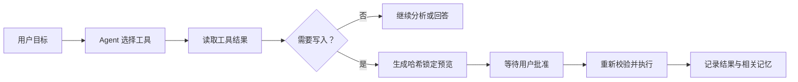

# SkillHub

[English](README_EN.md) · [使用说明书](docs/SkillHub使用说明书.md) · [下载最新版](https://github.com/w1ndwill/skill_store/releases/latest) · [MIT License](LICENSE)

SkillHub 是一个本地运行的 Windows Skill 工作台，用来集中管理 AI 开发规约、组织多 Skill 集合，并为不同项目维护可预览、可回退的 Skill 配置。当前版本：**3.2.0**。

> **项目演进说明**
>
> 本项目没有从零重做一个独立 Agent，而是复用了现有 SkillHub 的技能库、导入、分类、项目同步和回滚能力，将原有 AI 助手升级为 **SkillOps Agent**。模型现在可以自主选择工具、读取工具结果、持续推进任务、调用结构化记忆，并在写入前进入用户审批门。


*截图来自 v3.2.0 便携版；技能名称、项目路径和启用状态取自本地演示环境。*

## SkillOps Agent

SkillOps Agent 面向 AI 编程 Skill 的生命周期管理，不提供任意终端，而是通过有边界的工具完成检索、检查、研究、预览、安装和项目同步。




*真实只读任务：Agent 在 2/32 步内调用 `search_skills`，确认 `self-improving-agent` 已安装；右侧只显示工具摘要、最终状态和相关记忆，不展示隐藏思维链。*

Agent 的关键能力：

- **真正的工具循环**：模型通过 Function Calling 自主选择工具，工具结果以 `tool` 消息返回并影响下一步。
- **官方目录安装**：读取固定的 SkillHub 安装文档，搜索精确 slug，在隔离区检查 ZIP 并锁定包哈希与文件树哈希。
- **GitHub Skill 导入**：支持预览单个 `SKILL.md`，也能识别 `skills/*/SKILL.md` 并保留仓库的集合边界。
- **写入审批**：所有 `apply_` 工具先暂停为 `waiting_approval`；批准后重新校验预览、目标状态和哈希。
- **结构化记忆**：按任务召回项目事实、用户偏好和历史决策；记忆可以查看、关闭或清理。
- **可恢复运行**：任务、审批和脱敏运行记录保存在本机，重启后可以继续处理。
- **失控保护**：默认最多 32 次模型决策；连续重复相同工具决策会提前停止。

## Skill 管理与项目同步

### 项目独立配置


每个项目独立选择需要的 Skill。界面同时展示来源说明、分类、同步状态和启用开关；底部操作栏汇总待应用变化，并在写入前打开同步预览。

同步产物位于：

```text
<项目目录>\.agent\skills\
<项目目录>\AGENTS.md
```

### 多 Skill 集合


仓库级导入会先扫描集合边界。集合可以整体停用，子 Skill 仍可单独查看和选择；关闭集合不会删除源文件或丢失子项选择。

### Skill 文档详情


详情抽屉展示来源、分类、标签、Frontmatter 和渲染后的 Markdown。编辑操作显式进入源文件，项目专属 Skill 保持只读。

## 主要功能

| 能力 | 当前行为 |
| --- | --- |
| 全局技能库 | 管理 Markdown 规则、标准 `SKILL.md` 文件夹和 Skill 集合 |
| 导入体检 | 识别重复、同名冲突、风险条目、路径穿越和符号链接 |
| 双语说明 | 根据界面语言使用展示缓存，不改写第三方 `SKILL.md` |
| 项目同步 | 先预览新增、更新、移除和冲突，再执行写入 |
| 同步撤销 | 项目文件未被继续修改时，可安全撤销最近一次同步 |
| 单实例运行 | 第二次启动唤醒已有窗口，不创建第二个应用窗口 |
| 本地数据 | Skill、配置、会话、Agent 记忆和备份均保存在本机 |

## 快速开始

1. 从 [GitHub Releases](https://github.com/w1ndwill/skill_store/releases/latest) 下载 `SkillHub.exe`。
2. 启动程序并选择全局 Skill 库目录。
3. 导入 `.md`、`.zip`、标准 Skill 文件夹或 Skill 集合。
4. 添加目标项目并选择需要的 Skill。
5. 查看同步预览，确认后写入项目。
6. 需要自动检查、安装或维护 Skill 时，打开 SkillOps Agent 并输入目标。

程序为便携版，无需安装。首次启动时默认创建：

```text
%LOCALAPPDATA%\SkillHub\skills
```

## 从源码运行

```powershell
git clone https://github.com/w1ndwill/skill_store.git
cd skill_store
python -m venv .venv
.\.venv\Scripts\Activate.ps1
python -m pip install -r requirements.txt
python main.py
```

构建便携版：

```powershell
python -m pip install pyinstaller
pyinstaller --clean --noconfirm SkillHub.spec
```

## 仓库结构

```text
├── agent_runtime.py         # Agent 循环、工具协议、审批、记忆与运行记录
├── main.py                  # 后端、文件操作、同步与 Agent 工具适配
├── static/                  # PyWebView 前端、交互与本地资源
├── docs/
│   ├── SkillHub使用说明书.md
│   └── screenshots/
│       ├── zh/              # 中文界面截图
│       └── en/              # 英文界面截图
├── SkillHub.spec            # PyInstaller 构建入口
└── requirements.txt
```

## 安全与隐私

- API Key 只保存在本地配置中，界面仅显示脱敏状态。
- Agent 记忆和运行记录不保存 API Key、完整敏感文件或隐藏思维链。
- 同名不同内容必须明确选择替换、保留两个版本或取消。
- 导入过程不会执行仓库中的 Hook、MCP 服务、安装脚本或下载代码。
- 项目中不受 SkillHub 管理的同名文件不会被静默覆盖。
- Release 不包含个人 Skill、本地配置、测试、会话、记忆或运行日志。

## 技术栈

- Python + [pywebview](https://pywebview.flowrl.com/)
- 系统 WebView2
- HTML、CSS、JavaScript
- 可选的 OpenAI 兼容接口与 DuckDuckGo 联网搜索

## 开源协议

[MIT](LICENSE)
