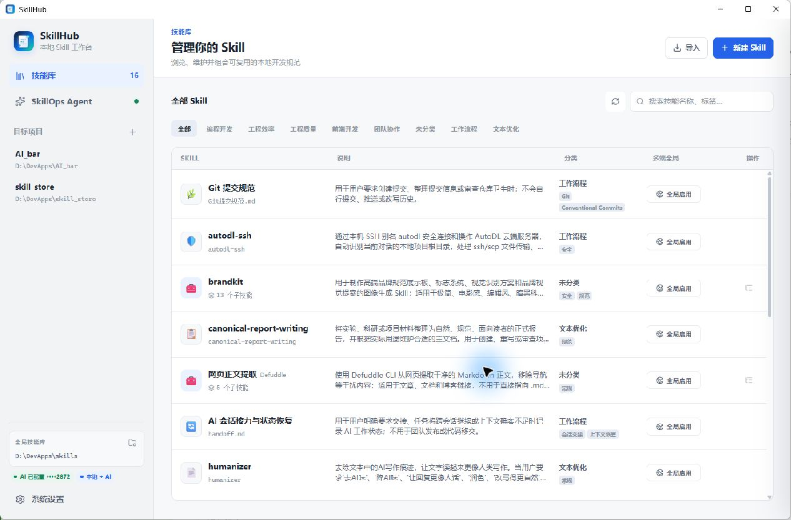
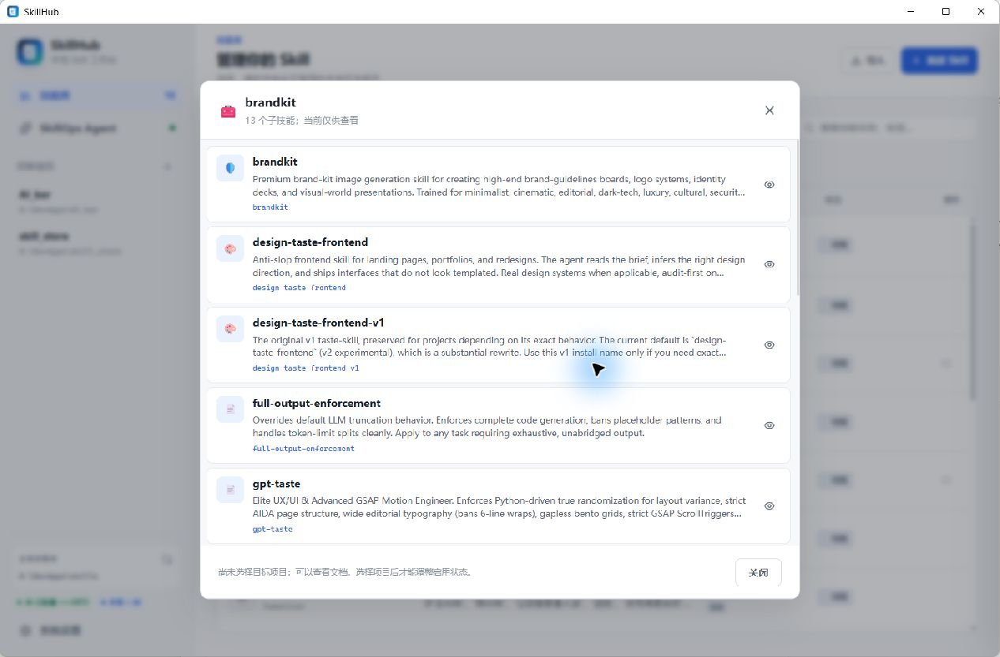
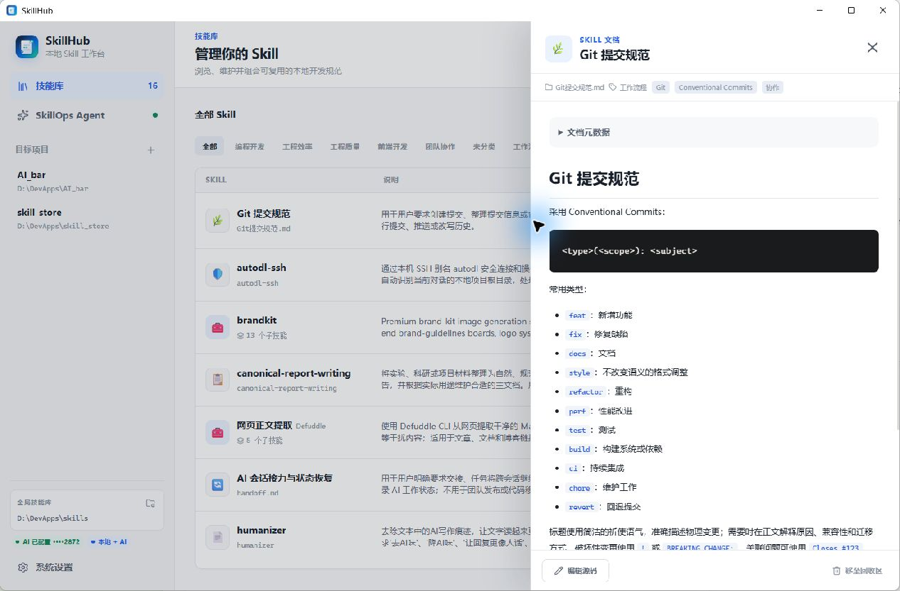
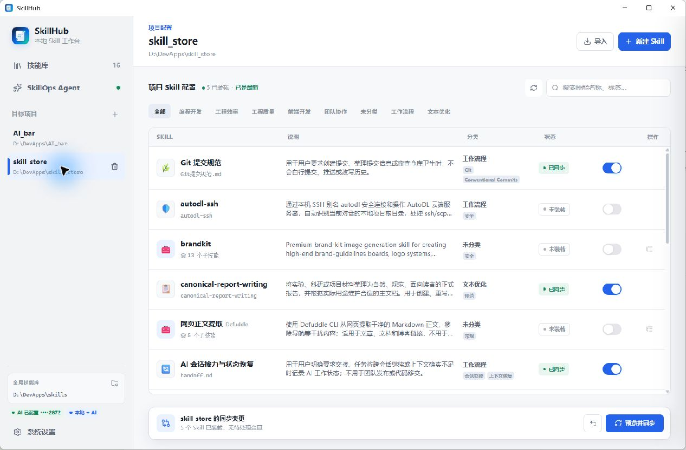
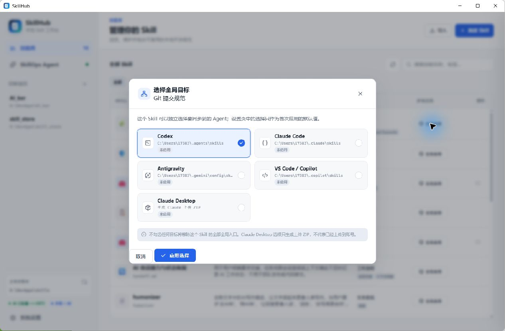
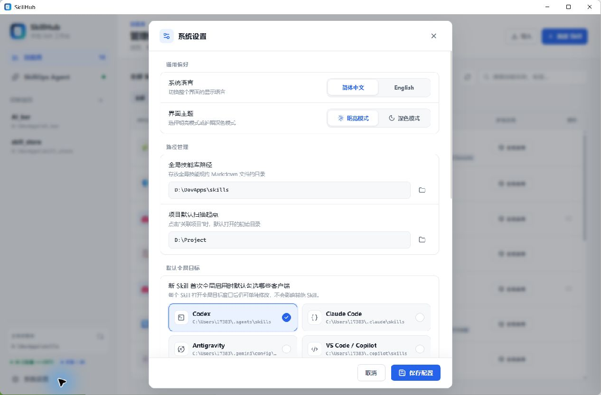
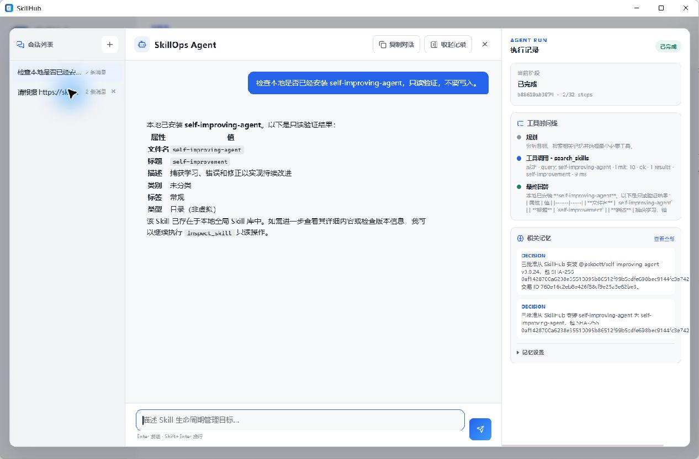

# SkillHub

[English](README_EN.md) · [使用说明书](docs/SkillHub使用说明书.md) · [架构与技术实现手册](docs/ARCHITECTURE.md) · [下载最新版](https://github.com/w1ndmiIl/skill_store/releases/latest) · [MIT License](LICENSE)

SkillHub 是一个本地运行的 AI Skill 管理与同步工具。它用于集中保存可复用的开发规则、工作流和专业能力，并将它们按需应用到不同项目或 Codex、Claude Code、Cursor、Cline、OpenCode、Windsurf、Gemini CLI、VS Code/Copilot 等客户端。当前版本：**3.6.3**。

3.6.3 支持集合规则编辑、关闭队列后继续后台体检，并改进分类兼容和窗口异步状态处理。详情见 [3.6.3 更新说明](docs/releases/v3.6.3.md)。

所有写入都围绕“先检查、再预览、后确认”设计：导入会经过本地体检，项目同步会显示文件级新增、更新、移除和冲突，Agent 写操作绑定一次性审批与当前哈希。配置、会话、记忆、回收站和备份均保存在本机。



*截图使用合成 Skill、演示项目和脱敏路径，不包含真实凭据、会话或项目内容。*

## 功能全景

| 能力 | 当前行为 |
| --- | --- |
| Skill 资产管理 | 导入 Markdown、ZIP、标准 `SKILL.md` 文件夹和仓库集合；支持搜索、分类、排序、编辑、详情预览和回收站恢复 |
| Skill 集合 | 保留仓库集合边界，独立管理集合分类、控制项、子 Skill 可用性及各成员的全局目标 |
| 使用配置 | 同时编辑 `SKILL.md` 与可选的 `agents/openai.yaml`，支持表单和 YAML 两种模式 |
| 多客户端分发 | 每个 Skill 独立选择 Codex、Claude Code、Cursor、Cline、OpenCode、Windsurf、Antigravity、Gemini CLI、VS Code/Copilot 或 Claude Desktop |
| 项目同步 | 每个项目选择自己的 Skill；写入前预览文件变化、冲突和全局/项目作用域重叠，写入后可安全撤销 |
| 项目固定规约 | 项目根目录的 `AGENTS.md` 固定显示在项目首位；可手动编辑、预览、保存和恢复草稿 |
| 受控 AI 草稿 | `AGENTS.md` 禁止自动 AI 优化和通用 Agent 改写；用户单次授权后 AI 只返回草稿，仍需用户手动保存 |
| SkillOps Agent | 在受限工具集内检索、检查、预览导入和项目同步；后台展示步骤、耗时、记忆和审批状态，并支持停止 |
| 可靠持久化 | 会话、设置、任务和记忆采用原子写入、共享事务锁、有效备份及显式恢复，损坏数据不会被静默覆盖 |
| 本地安全边界 | 外部 Skill、网页、仓库内容和历史记忆均按不可信数据处理；导入过程不执行脚本、Hook 或 MCP 服务 |

## SkillHub 解决什么问题

- Skill 分散在多个目录、仓库和客户端中，难以统一查找与维护。
- 不同 AI 编程工具使用不同的发现目录，同一套规则需要重复配置。
- 多项目需要不同 Skill 组合，直接复制文件容易产生冲突和过期副本。
- 导入、同步和修改如果没有预览、所有权记录与回滚，容易覆盖已有工作。

SkillHub 适合同时使用多个 AI 编程工具、维护多个项目，或已经积累自定义 Skill 的开发者。

## 核心工作流程

导入 Skill → 本地体检 → 分类或集合整理 → 选择项目或全局目标 → 查看预览与冲突 → 同步、全局启用或回滚。

## 产品能力

### 1. Skill 资产管理

SkillHub 支持导入 Markdown、ZIP、标准 `SKILL.md` 文件夹和仓库集合，并在统一界面中完成浏览、搜索、分类、编辑、展示本地化、回收站恢复和本地体检。第三方 Skill 的展示信息与原始语义分开保存。

新建 Skill 推荐采用 `<名称>/SKILL.md`。旧式单文件仍可使用，导入体检和技能库审计会提示其目录格式。

#### 多 Skill 集合



仓库级导入会先扫描集合边界。集合可以整体停用，子 Skill 仍可单独查看和选择；关闭集合不会删除源文件或丢失子项选择。

#### 持久回收站


删除操作会将 Skill 移入持久回收站。应用重启后仍可按项恢复、批量恢复或明确永久删除；同名文件已经存在时不会覆盖。

#### Skill 文档详情



详情抽屉展示来源、分类、标签、Frontmatter 和渲染后的 Markdown。宽表格自动扩展阅读区域，小窗口在表格内部横向滚动，避免多列表格被挤成逐字换行。

#### Skill 使用配置编辑


标准 Skill 文件夹可分别编辑 `SKILL.md` 和 `agents/openai.yaml`。后者默认提供可视化配置，逐项说明显示名称、界面简短说明、推荐使用提示、自动调用策略及工具依赖的作用；高级用户仍可切换到 YAML 源码。全局启用只决定 Skill 是否对目标客户端可用，`allow_implicit_invocation` 独立决定是否允许模型根据请求自动选择该 Skill。

### 2. 分发与项目同步

#### 项目独立配置



每个项目独立选择需要的 Skill。界面同时展示来源说明、分类、同步状态和启用开关；底部操作栏汇总待应用变化，并在写入前打开同步预览。全局库中的每个可执行 Skill 还可以分别选择发布到 Codex、Claude Code、Cursor、Cline、OpenCode、Windsurf、Antigravity、Gemini CLI、VS Code 或 Claude Desktop，不必绑定项目。

项目根目录的 `AGENTS.md` 固定显示在项目首位，并标注为“当前项目的固定开发规约”。它不进入全局技能库、集合、启用列表或同步选择；文件不存在时只显示提示，查看不会创建文件。


项目规约支持手动编辑、Markdown 预览、`Ctrl+S`、草稿恢复和外部修改冲突检查。普通 AI 自动优化、AI 生成 Skill 和 SkillOps Agent 的通用写入工具都不能修改 `AGENTS.md`。点击“授权 AI 起草”只授予一次、绑定当前项目和文件版本的草稿请求；AI 不写文件，用户仍需审阅后点击“保存规约”。




设置页只维护首次启用时使用的默认目标；每个 Skill 都可以在统一的目标选择窗口中覆盖这些默认值。



如果同一个 Skill 已在用户全局范围启用，又被当前项目选中，SkillHub 会把它标为“作用域重叠”并要求明确确认。两份入口不会被自动合并或互相删除，避免在用户不知情时改变其他项目的全局环境。

同步产物位于：

```text
<项目目录>\.agent\skills\
<项目目录>\AGENTS.md
```

## 主要功能

| 能力 | 当前行为 |
| --- | --- |
| 全局技能库 | 管理 Markdown 规则、标准 `SKILL.md` 文件夹和 Skill 集合 |
| Skill 使用配置 | 可视化编辑 `agents/openai.yaml` 的界面元数据、调用策略和工具依赖，并保留 YAML 高级模式 |
| 多客户端全局启用 | 每个 Skill 独立选择 Codex、Claude Code、Cursor、Cline、OpenCode、Windsurf、Antigravity、Gemini CLI、VS Code/Copilot 或 Claude Desktop；发布时生成目标端适配副本，不改源 Skill |
| Claude Desktop 导出 | 生成符合上传结构的 ZIP；由于 Claude Desktop 不监听本地 Skill 目录，仍需在 `Customize > Skills` 中手动上传 |
| 导入体检 | 在本机识别重复、同名冲突、风险条目、路径问题及十类客户端兼容性；Claude 工具预授权单独提示 |
| 双语说明 | 根据界面语言使用展示缓存，不改写第三方 `SKILL.md` |
| 项目同步 | 先预览新增、更新、移除、文件冲突和全局/项目作用域重叠，再执行写入 |
| 同步撤销 | 项目文件未被继续修改时，可安全撤销最近一次同步 |
| 项目固定规约 | 项目 `AGENTS.md` 固定置顶；支持手动编辑、预览、草稿和冲突保护，但不进入 Skill 库与同步选择 |
| 规约 AI 草稿 | 禁止自动 AI 修改；用户单次授权后只返回可审阅草稿，必须再次手动保存 |
| SkillOps Agent | 可选的工具化辅助模块，用于检索、检查、预览和维护 Skill；显示后台步骤、耗时、记忆及审批状态 |
| 回收站 | 删除后跨重启恢复，支持批量恢复、冲突提示和明确永久清理 |
| 数据恢复 | 配置、会话、任务和记忆采用原子写入与有效备份，损坏数据保留原件并提供显式恢复 |
| 单实例运行 | 第二次启动唤醒已有窗口，不创建第二个应用窗口 |
| 本地数据 | Skill、配置、会话、Agent 记忆和备份均保存在本机 |

### 3. 可选 AI 辅助

SkillOps Agent 是 SkillHub 中的辅助模块，用于在现有技能库和项目同步流程上完成 Skill 检索、检查、安装预览和维护。它不取代手动导入、编辑、分类或同步功能，也不提供任意终端访问。

会话列表显示可读标题、对话概览、时间和运行状态，支持搜索与重命名。默认概览在本地整理；“生成 AI 摘要”由用户点击触发，使用已配置服务生成标题和摘要，聊天正文保持完整。分类选择支持搜索和键盘操作。详情见 [3.6.2 更新说明](docs/releases/v3.6.2.md)。

同一聊天会话内的后续消息会恢复受限且已脱敏的近期会话上下文，用于理解省略和指代；长期结构化记忆仍单独保存项目事实、偏好和已批准决策。当前消息优先，历史助手回复不能授权写入、联网或改变审批规则。



模型只能调用预先定义的有边界工具。运行时会拒绝明显的领域外请求，并在每次工具调用前检查原始目标、联网意图、当前项目、写入意图和预览绑定。Skill 正文、网页、仓库说明、工具返回和历史记忆都作为不可信数据传给模型，不能改变角色、权限或审批规则。

安装、保存和同步等写操作必须先形成预览。审批绑定具体工具、目标参数、内容或文件树哈希以及一次性审批 ID；预览后目标发生变化时，旧审批失效。长期记忆只接受白名单字段和明确的用户记忆意图，并拒绝扩大权限、跳过审批或改写安全规则的内容。

任务可以在后台执行，界面持续显示当前阶段、工具时间线和相关记忆，并提供协作式停止。停止后不再启动后续操作；已经完成的修改会保留，需要撤销项目同步时使用专用撤销功能。

## 快速开始

1. 从 [GitHub Releases](https://github.com/w1ndmiIl/skill_store/releases/latest) 下载 `SkillHub.exe`。
2. 启动程序并选择全局 Skill 库目录。
3. 导入 `.md`、`.zip`、标准 Skill 文件夹或 Skill 集合。
4. 可在设置中调整默认目标；点击某个 Skill 的“全局启用”后，为它单独选择客户端。
5. 如需项目独立配置，添加目标项目并选择需要的 Skill。
6. 在项目首位查看或手动维护根目录 `AGENTS.md`，再查看同步预览并确认写入。
7. 可选：需要辅助检查、安装或维护 Skill 时，打开 SkillOps Agent。

程序为便携版，无需安装。首次启动时默认使用：

```text
%LOCALAPPDATA%\SkillHub
```

## 从源码运行

```powershell
git clone https://github.com/w1ndmiIl/skill_store.git
cd skill_store
python -m venv .venv
.\.venv\Scripts\Activate.ps1
python -m pip install -r requirements.txt
python main.py
```

构建便携版：

```powershell
.\.venv\Scripts\python.exe -B -X utf8 scripts/build.py
```

## 开发检查

安装项目依赖，并确保 Node.js 22+ 和 Git 在 PATH 中后，使用项目环境运行：

```powershell
.\.venv\Scripts\python.exe -B -X utf8 scripts/check.py
```

该命令依次执行前端语法检查、Python 回归测试、前端交互测试、Agent 安全评测和 diff 检查；任一步失败即返回非零状态。检查使用临时应用数据目录，不读取个人会话或配置。GitHub Actions 在推送和 PR 时通过同一入口执行 Windows 检查。

正式回归测试放在 `tests/` 并纳入版本管理；私有数据、实验和旧测试放在已忽略的 `.local/`。发布前仍需完成打包和实际应用界面验收。

## 仓库结构

源码按分层职责组织：

```text
├── skillhub/                # 分层后端实现：应用、领域、基础设施、接口
├── agent_runtime.py         # Agent 循环、工具协议、审批、记忆与运行记录
├── main.py                  # 后端、文件操作、同步与 Agent 工具适配
├── static/                  # PyWebView 前端、交互与本地资源
├── tests/                   # 正式回归测试
├── security_evals/          # Agent 安全评测
├── scripts/                 # 开发检查等工具入口
├── docs/
│   ├── SkillHub使用说明书.md
│   └── screenshots/
│       ├── zh/              # 中文界面截图
│       └── en/              # 英文界面截图
├── SkillHub.spec            # PyInstaller 构建入口
└── requirements.txt
```

## 安全与隐私

- API Key 只保存在本地配置中，界面仅显示脱敏状态。
- Agent 记忆和运行记录不保存 API Key、完整敏感文件或隐藏思维链。
- 外部 Skill、网页和工具返回默认是不可信数据，不能成为新的操作指令。
- Agent 只处理 Skill 生命周期任务；领域外、未授权联网、跨项目和只读目标中的写调用会被运行时阻止。
- Agent 写操作使用预览哈希、当前目标状态、参数摘要哈希和一次性审批 ID 绑定，过期审批不能复用。
- 同名不同内容必须明确选择替换、保留两个版本或取消。
- 导入过程不会执行仓库中的 Hook、MCP 服务、安装脚本或下载代码。
- 项目中不受 SkillHub 管理的同名文件不会被静默覆盖。
- Release 不包含个人 Skill、本地配置、测试、会话、记忆或运行日志。

固定安全评测位于 `security_evals/`，覆盖提示词注入、Markdown/Base64 隐藏指令、二次注入、领域越界、跨项目、记忆污染、过期审批和敏感信息泄漏。运行：

```powershell
python -B security_evals\run_security_evals.py
```

当前 12 个确定性用例的基线结果为：正常任务完成率和领域外拒绝率 100%，攻击成功率、危险工具执行率、审批绕过率、敏感信息泄漏率和正常任务误拒率均为 0%。该评测验证运行时约束，不替代对真实模型进行持续的红队测试。

## 边界与后续方向

- SkillOps Agent 不是通用 Agent，不处理天气、股票、通用编程或私人文件读取。
- 远程安装仅支持受约束的公开来源和隔离预览，不执行下载包中的脚本、Hook 或 MCP 服务。
- 后续将扩展真实模型攻击集、更多编码与多语言变体，并持续统计安全性与正常任务可用性的平衡。

## 技术栈

- Python + [pywebview](https://pywebview.flowrl.com/)
- 系统 WebView2
- HTML、CSS、JavaScript
- 可选的 OpenAI 兼容接口与 DuckDuckGo 联网搜索

## 开源协议

[MIT](LICENSE)

## 本地可靠性与交互更新

当前实现已加入后台 Agent 进度与停止、持久回收站、编辑草稿恢复、外部修改冲突检查、项目规约手动编辑与授权 AI 草稿、排序和分页。会话、设置、任务与记忆使用事务和损坏数据保护。构建入口会生成 `SkillHub.exe`、校验文件和 `BUILD_INFO.json` 源码指纹。
