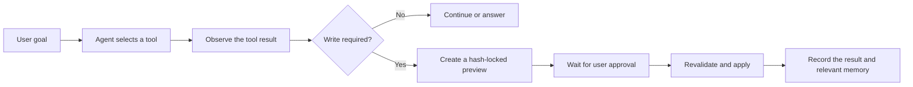

# SkillHub

[中文](README.md) · [User manual](docs/SkillHub使用说明书.md) · [Download the latest release](https://github.com/w1ndwill/skill_store/releases/latest) · [MIT License](LICENSE)

SkillHub is a local Windows workspace for organizing reusable AI development guidance, preserving multi-Skill collections, and maintaining reviewable, reversible Skill configurations for individual projects. Current version: **3.2.0**.

> **How this project evolved**
>
> This work did not replace SkillHub with a separate Agent product. It retained the existing library, import, categorization, project sync, and rollback features, then upgraded the original AI assistant into **SkillOps Agent**. The model can now select tools, observe their results, continue a task, recall structured memory, and stop at an approval gate before any write.


*Captured from the v3.2.0 portable build. Skill names, project paths, and enablement states come from the local demonstration environment.*

## SkillOps Agent

SkillOps Agent focuses on the lifecycle of AI coding Skills. It does not receive an unrestricted shell; instead, it works through bounded tools for discovery, inspection, research, preview, installation, and project synchronization.




*A real read-only run verifies `self-improving-agent` through `search_skills`, `inspect_skill`, and `recall_memory`. The activity panel shows redacted summaries and final state, never hidden chain of thought. Earlier Chinese sessions remain visible because the screenshot uses the same persistent bilingual test workspace.*

Key Agent capabilities:

- **Real tool loop** — The model selects Function Calling tools, receives `tool` observations, and uses them in the next decision.
- **Official catalog installation** — Read the fixed SkillHub guide, resolve an exact slug, inspect the ZIP in isolation, and lock both package and tree hashes.
- **GitHub Skill imports** — Preview one original `SKILL.md`, or detect `skills/*/SKILL.md` and preserve the repository as a collection.
- **Approval-gated writes** — Every `apply_` tool pauses as `waiting_approval`; preview, target state, and hashes are revalidated after approval.
- **Structured memory** — Recall relevant project facts, preferences, and decisions; memory can be viewed, disabled, or cleared.
- **Recoverable runs** — Tasks, approvals, and redacted run records remain local and can survive an application restart.
- **Loop protection** — A run receives up to 32 model decisions by default and stops early after repeated identical tool choices.

## Skill management and project sync

### Per-project configuration


Each project selects its own Skills. The view combines source descriptions, categories, sync status, and enablement controls. A bottom action bar summarizes pending changes and opens a preview before writing.

Generated project content lives at:

```text
<project>\.agent\skills\
<project>\AGENTS.md
```

### Multi-Skill collections


Repository imports are scanned for collection boundaries. A collection can be disabled as a unit while each child Skill remains reviewable and independently selectable.

### Skill document details


The detail drawer presents source information, category, tags, Frontmatter, and rendered Markdown. Editing explicitly opens the source; project-only Skills remain read-only.

## Main features

| Capability | Current behavior |
| --- | --- |
| Global Skill library | Manage Markdown guidance, standard `SKILL.md` folders, and Skill collections |
| Import inspection | Detect duplicates, same-name conflicts, risky entries, traversal, and symbolic links |
| Bilingual descriptions | Use display-only localization without rewriting third-party `SKILL.md` |
| Project synchronization | Preview additions, updates, removals, and conflicts before writing |
| Sync rollback | Undo the most recent sync when affected project files have not changed again |
| Single-instance startup | A second launch focuses the existing window instead of opening another |
| Local data model | Skills, settings, sessions, Agent memory, and backups stay on the machine |

## Quick start

1. Download `SkillHub.exe` from [GitHub Releases](https://github.com/w1ndwill/skill_store/releases/latest).
2. Launch the app and choose a global Skill library.
3. Import a `.md`, `.zip`, standard Skill folder, or Skill collection.
4. Add a target project and select the Skills it needs.
5. Review the sync preview, then confirm the write.
6. Open SkillOps Agent when you want to inspect, install, or maintain Skills through a tool-driven workflow.

The application is portable and requires no installer. On first launch it creates:

```text
%LOCALAPPDATA%\SkillHub\skills
```

## Run from source

```powershell
git clone https://github.com/w1ndwill/skill_store.git
cd skill_store
python -m venv .venv
.\.venv\Scripts\Activate.ps1
python -m pip install -r requirements.txt
python main.py
```

Build the portable executable:

```powershell
python -m pip install pyinstaller
pyinstaller --clean --noconfirm SkillHub.spec
```

## Repository layout

```text
├── agent_runtime.py         # Agent loop, tool protocol, approvals, memory, and run records
├── main.py                  # Backend, file operations, sync, and Agent tool adapters
├── static/                  # PyWebView frontend, interactions, and bundled resources
├── docs/
│   ├── SkillHub使用说明书.md
│   └── screenshots/
│       ├── zh/              # Chinese interface screenshots
│       └── en/              # English interface screenshots
├── SkillHub.spec            # PyInstaller build entry
└── requirements.txt
```

## Security and privacy

- API keys remain in local configuration and are shown only in masked form.
- Agent memory and run records exclude API keys, complete sensitive files, and hidden chain of thought.
- Same-name, different-content targets require an explicit replace, keep-both, or cancel decision.
- Imports never execute repository hooks, MCP servers, installer scripts, or downloaded code.
- Unmanaged project files are not silently overwritten.
- Release builds exclude personal Skills, local configuration, tests, sessions, memory, and run logs.

## Tech stack

- Python + [pywebview](https://pywebview.flowrl.com/)
- System WebView2 runtime
- HTML, CSS, and JavaScript
- Optional OpenAI-compatible API and DuckDuckGo web search

## License

[MIT](LICENSE)
