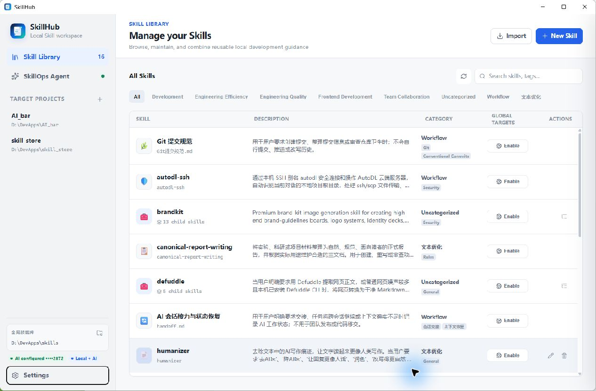
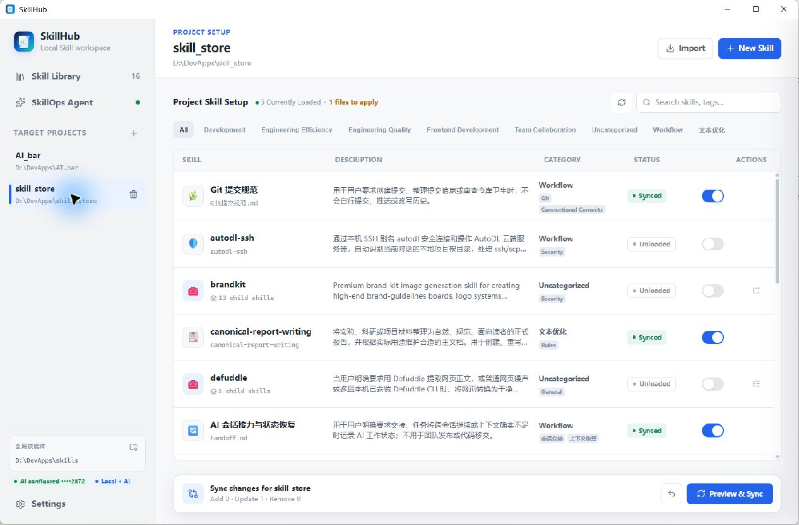
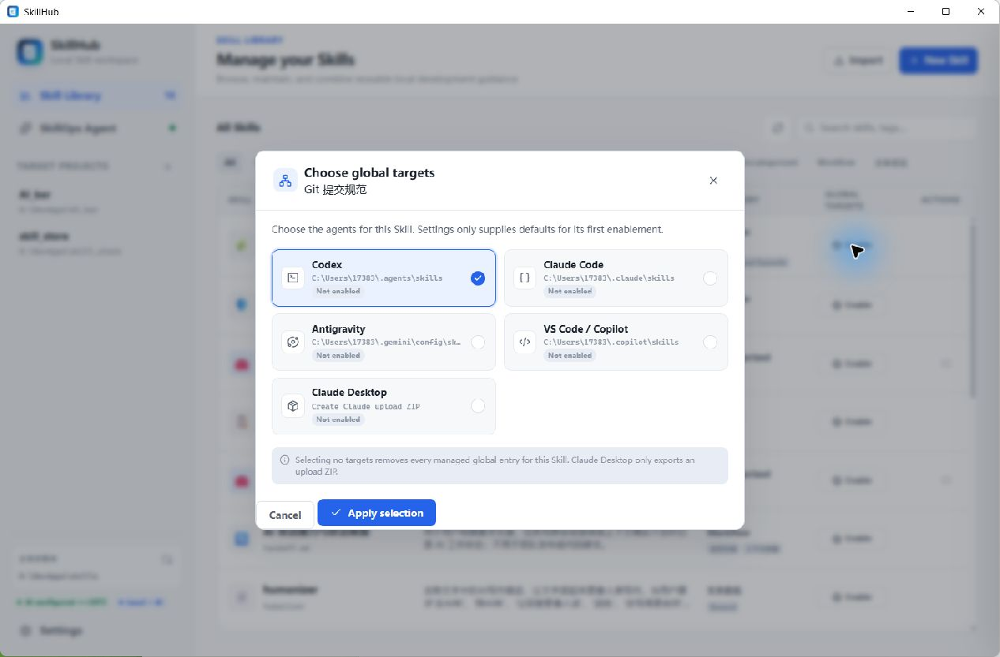
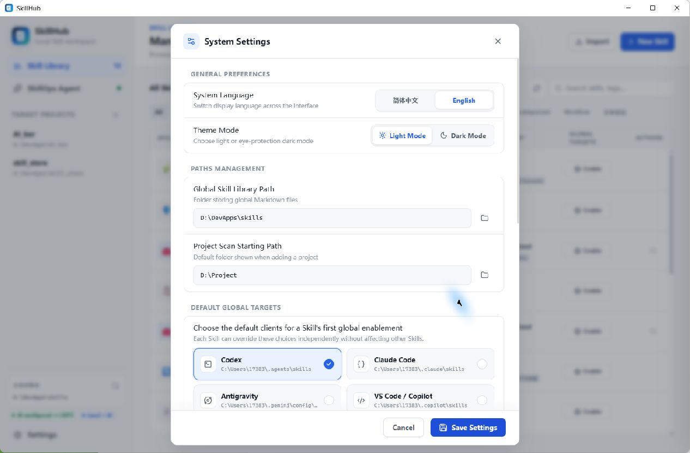
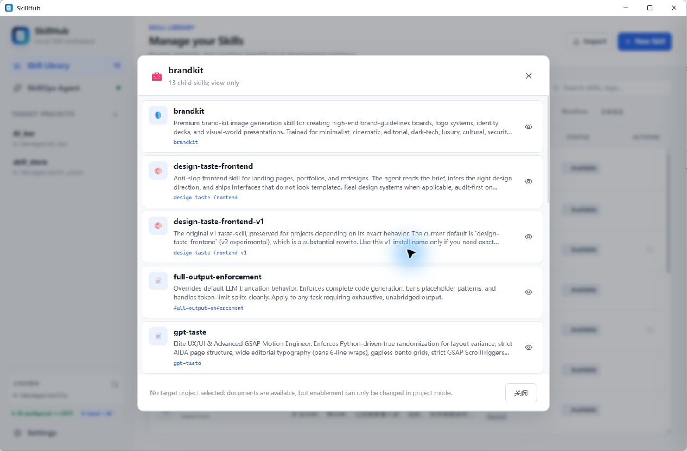
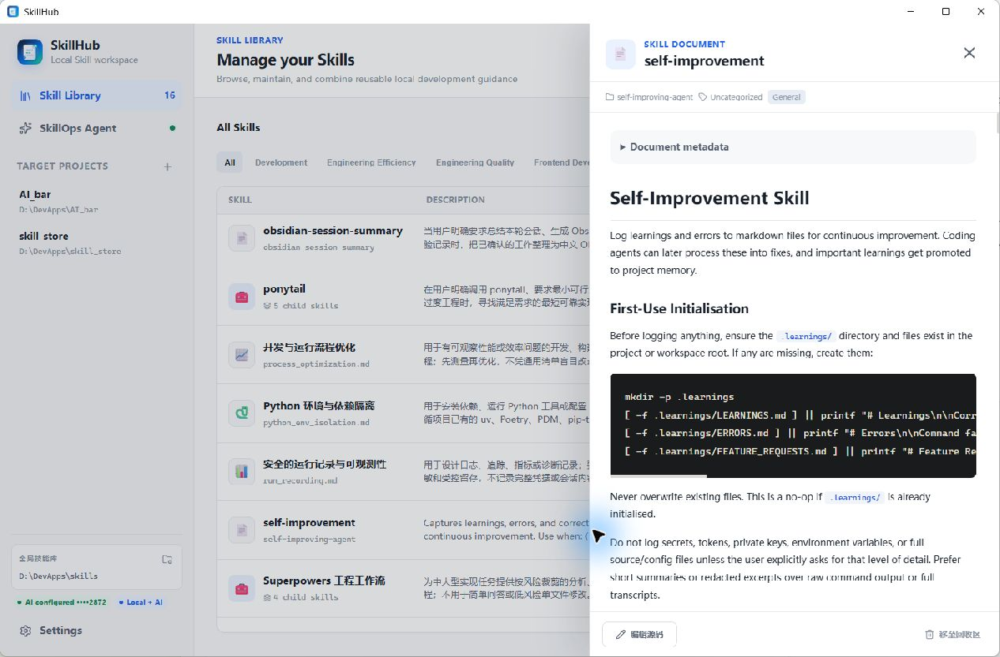
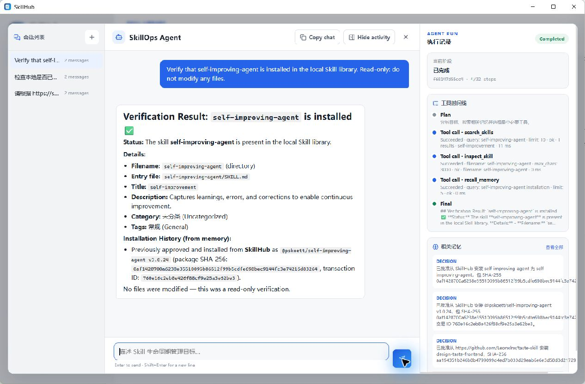

# SkillHub

[中文](README.md) · [User manual](docs/SkillHub使用说明书.md) · [Download the latest release](https://github.com/w1ndwill/skill_store/releases/latest) · [MIT License](LICENSE)

SkillHub is a local Windows workspace for organizing reusable AI development guidance, preserving multi-Skill collections, and maintaining reviewable, reversible Skill configurations for individual projects. Current version: **3.3.0**.



*Captured from the v3.3.0 portable build. Skill names, project paths, and enablement states come from the local demonstration environment.*

## Skill management and project sync

### Per-project configuration



Each project selects its own Skills. The view combines source descriptions, categories, sync status, and enablement controls. A bottom action bar summarizes pending changes and opens a preview before writing. Every executable library Skill can independently target Codex, Claude Code, Antigravity, VS Code, or Claude Desktop without binding it to a project.



Settings only maintains first-enable defaults; each Skill can override them in the same target-selection dialog.



If the same Skill is already enabled in user scope and selected for the current project, SkillHub reports a scope overlap and requires explicit confirmation. It does not merge or automatically remove either entry, avoiding silent changes to the global environment used by other projects.

Generated project content lives at:

```text
<project>\.agent\skills\
<project>\AGENTS.md
```

### Multi-Skill collections



Repository imports are scanned for collection boundaries. A collection can be disabled as a unit while each child Skill remains reviewable and independently selectable.

### Skill document details



The detail drawer presents source information, category, tags, Frontmatter, and rendered Markdown. Editing explicitly opens the source; project-only Skills remain read-only.

## Main features

| Capability | Current behavior |
| --- | --- |
| Global Skill library | Manage Markdown guidance, standard `SKILL.md` folders, and Skill collections |
| Multi-client global enablement | Choose Codex, Claude Code, Antigravity, VS Code/Copilot, or Claude Desktop independently for each Skill; Settings only supplies first-enable defaults |
| Claude Desktop export | Build a correctly structured upload ZIP; Claude Desktop still requires manual upload from `Customize > Skills` because it does not watch a local Skill directory |
| Import inspection | Detect duplicates, same-name conflicts, risky entries, traversal, and symbolic links |
| Bilingual descriptions | Use display-only localization without rewriting third-party `SKILL.md` |
| Project synchronization | Preview additions, updates, removals, file conflicts, and global/project scope overlaps before writing |
| Sync rollback | Undo the most recent sync when affected project files have not changed again |
| SkillOps Agent | Optional tool-assisted module for finding, inspecting, previewing, and maintaining Skills |
| Single-instance startup | A second launch focuses the existing window instead of opening another |
| Local data model | Skills, settings, sessions, Agent memory, and backups stay on the machine |

## Optional AI assistance

SkillOps Agent is an auxiliary module built on top of SkillHub's existing library and project synchronization workflows. It can help find, inspect, preview, install, and maintain Skills, but it does not replace manual imports, editing, categorization, or synchronization and does not expose an unrestricted shell.



The model can only call predefined bounded tools. Read-only work may finish directly, while installation, saving, and synchronization still require a preview and explicit user approval. Task records and structured memory remain local and can be disabled or cleared.

## Quick start

1. Download `SkillHub.exe` from [GitHub Releases](https://github.com/w1ndwill/skill_store/releases/latest).
2. Launch the app and choose a global Skill library.
3. Import a `.md`, `.zip`, standard Skill folder, or Skill collection.
4. Optionally adjust target defaults in Settings, then choose clients separately from each Skill's global action.
5. For per-project configuration, add a target project and select the Skills it needs.
6. Review the sync preview, then confirm the write.
7. Optional: open SkillOps Agent for assisted inspection, installation, or maintenance.

The application is portable and requires no installer. On first launch it creates:

```text
%LOCALAPPDATA%\SkillHub\skills
```

## Run from source

```powershell
git clone https://github.com/w1ndwill/skill_store.git
cd skill_store
python -m venv .venv
.\.venv\Scripts\Activate.ps1
python -m pip install -r requirements.txt
python main.py
```

Build the portable executable:

```powershell
python -m pip install pyinstaller
pyinstaller --clean --noconfirm SkillHub.spec
```

## Repository layout

```text
├── agent_runtime.py         # Agent loop, tool protocol, approvals, memory, and run records
├── main.py                  # Backend, file operations, sync, and Agent tool adapters
├── static/                  # PyWebView frontend, interactions, and bundled resources
├── docs/
│   ├── SkillHub使用说明书.md
│   └── screenshots/
│       ├── zh/              # Chinese interface screenshots
│       └── en/              # English interface screenshots
├── SkillHub.spec            # PyInstaller build entry
└── requirements.txt
```

## Security and privacy

- API keys remain in local configuration and are shown only in masked form.
- Agent memory and run records exclude API keys, complete sensitive files, and hidden chain of thought.
- Same-name, different-content targets require an explicit replace, keep-both, or cancel decision.
- Imports never execute repository hooks, MCP servers, installer scripts, or downloaded code.
- Unmanaged project files are not silently overwritten.
- Release builds exclude personal Skills, local configuration, tests, sessions, memory, and run logs.

## Tech stack

- Python + [pywebview](https://pywebview.flowrl.com/)
- System WebView2 runtime
- HTML, CSS, and JavaScript
- Optional OpenAI-compatible API and DuckDuckGo web search

## License

[MIT](LICENSE)
