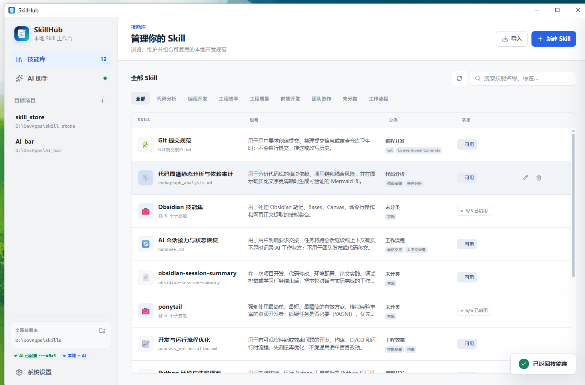
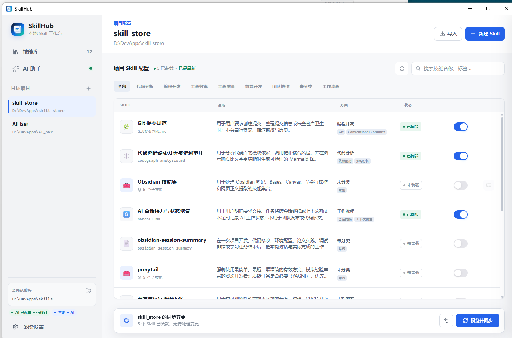
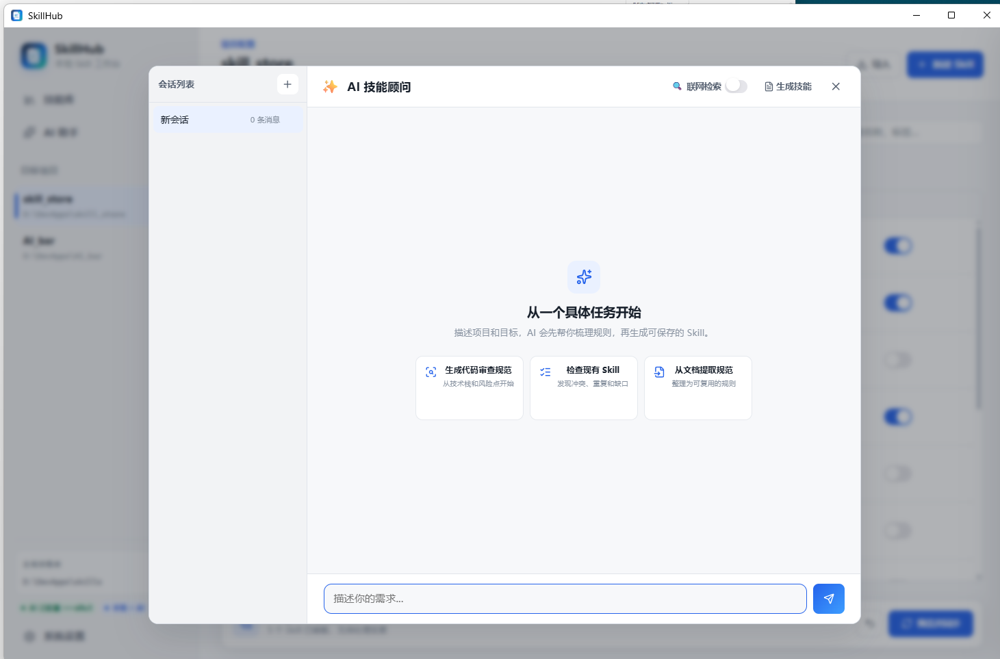
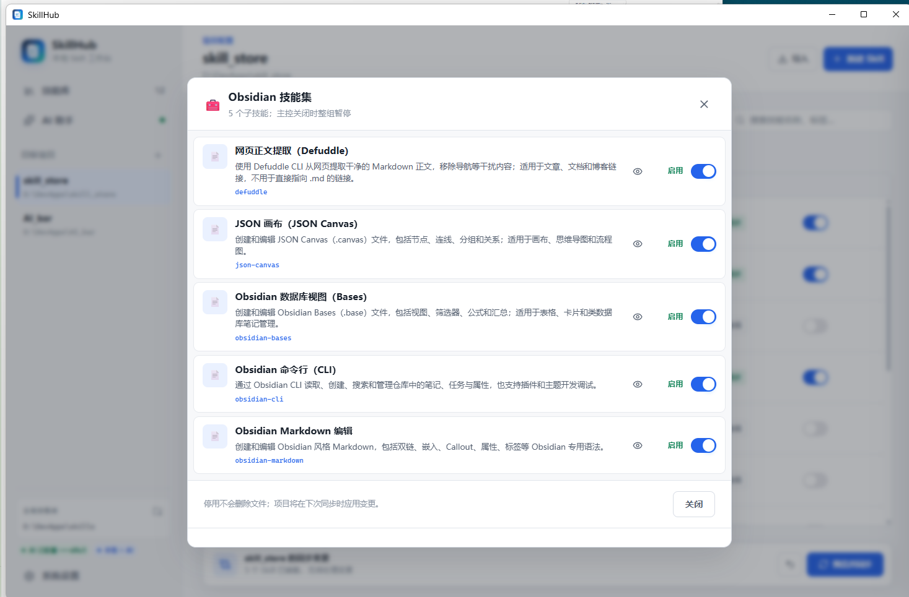
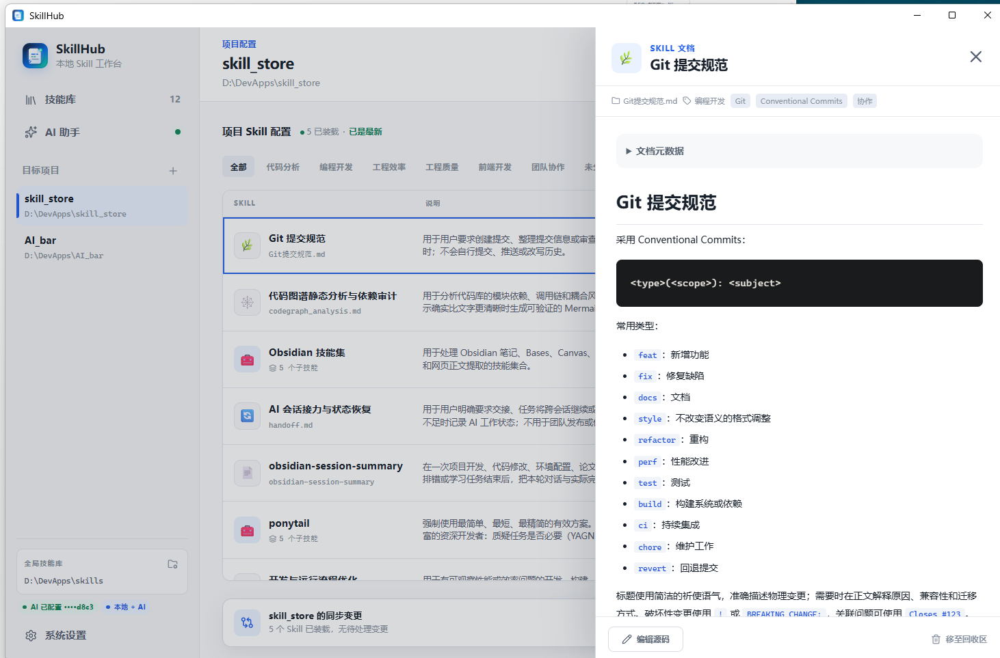

# SkillHub

[中文](README.md) · [Download SkillHub](https://github.com/w1ndwill/skill_store/releases) · [MIT License](LICENSE)

SkillHub is a local Windows workspace for organizing reusable AI development rules and maintaining a clear, reviewable, and reversible Skill configuration for each project.



Current version: **3.1.1**

## Features

- **Unified Skill library** — Manage Markdown rules, standard `SKILL.md` folders, and collections containing multiple child Skills; add, change, or delete categories from the editor.
- **Per-project configuration** — Select the Skills each project needs without affecting other projects.
- **Sync preview** — Review additions, updates, removals, and conflicts before writing to `.agent/skills/`.
- **Collection controls** — The collection switch controls whether the collection participates in a project; child switches select individual Skills.
- **Document viewer and editor** — Review metadata and rendered Markdown, then open the source explicitly when editing is needed.
- **Clear view-only mode** — Browse Skills without selecting a project; choose a project before changing enablement.
- **AI Skill advisor** — Use an OpenAI-compatible model to draft rules, inspect Skills, or organize an existing document.
- **Local data model** — Skill libraries, project settings, chat sessions, and sync backups remain on the local machine.
- **Reversible sync** — The most recent sync can be undone when affected project files have not been edited again.

## Interface

### Project Skill configuration



The project view keeps categories, search, sync status, and enable controls together. The bottom action bar summarizes pending changes and opens the preview before synchronization.

### AI Skill advisor



Start from a concrete task, an existing Skill, or a reference document. AI access is optional and is not required for local imports, organization, or project sync.

### Skill collections



Child Skills can be reviewed and selected independently. A disabled collection does not participate in project configuration, while its child selections remain stored locally.

### Skill documents



The detail panel presents source information, category, tags, metadata, and rendered Markdown before a Skill is enabled.

## Workflow

1. Import a `.md` file, `.zip` archive, standard Skill folder, or Skill collection.
2. Review the Skill name, description, category, and document body.
3. Add a target project and select the Skills it should use.
4. Open the sync preview and confirm the file changes.
5. Project AI tools consume the generated `AGENTS.md` and `.agent/skills/` content.

## Download and run

Download `SkillHub.exe` from [GitHub Releases](https://github.com/w1ndwill/skill_store/releases). It is a portable application and requires no installation.

On first launch, SkillHub creates the local library at:

```text
%LOCALAPPDATA%\SkillHub\skills
```

Import archives, sync state, and backups are maintained in the local data directory. The source repository does not contain personal Skills, API keys, chat sessions, or project configuration.

## Run from source

```powershell
git clone https://github.com/w1ndwill/skill_store.git
cd skill_store
python -m venv .venv
.\.venv\Scripts\Activate.ps1
python -m pip install -r requirements.txt
python main.py
```

Build the portable executable:

```powershell
python -m pip install pyinstaller
pyinstaller --clean --noconfirm SkillHub.spec
```

## Repository layout

```text
├── main.py                  # Backend, file operations, sync, and AI bridge
├── static/
│   ├── index.html           # Application structure
│   ├── index.css            # Interface styles
│   ├── app.js               # Frontend state and interactions
│   ├── lucide.min.js        # Bundled icon library
│   └── marked.min.js        # Bundled Markdown renderer
├── docs/screenshots/        # README interface screenshots
├── SkillHub.spec            # PyInstaller build entry
├── app.ico                  # Application icon
└── requirements.txt         # Runtime dependencies
```

## Security boundaries

- API keys are stored only in local configuration and are shown in masked form.
- Imports do not execute repository hooks, MCP servers, or installer scripts.
- ZIP traversal, symbolic-link sources, and target-path collisions are rejected.
- Unmanaged project files are not silently overwritten.
- Release builds exclude personal Skills, local configuration, tests, and chat sessions.

## Tech stack

- Python + [pywebview](https://pywebview.flowrl.com/)
- System WebView2 runtime
- HTML, CSS, and JavaScript
- Optional OpenAI-compatible API and DuckDuckGo web search

## License

[MIT](LICENSE)
