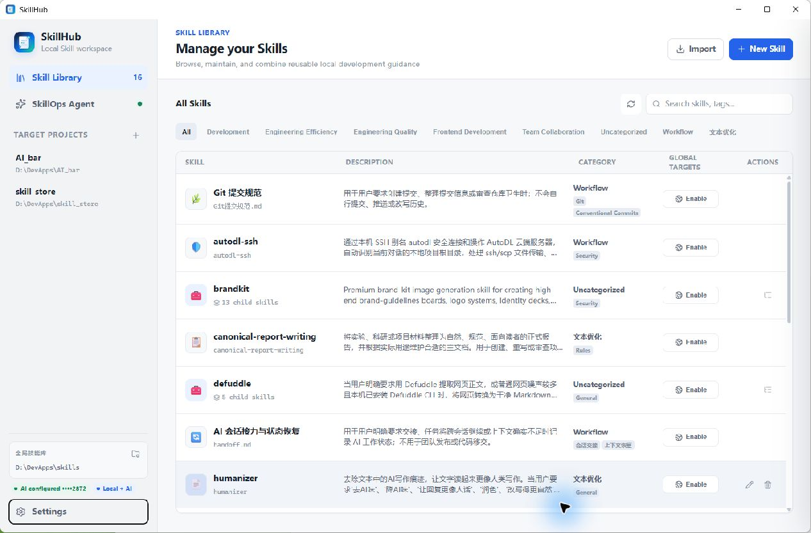
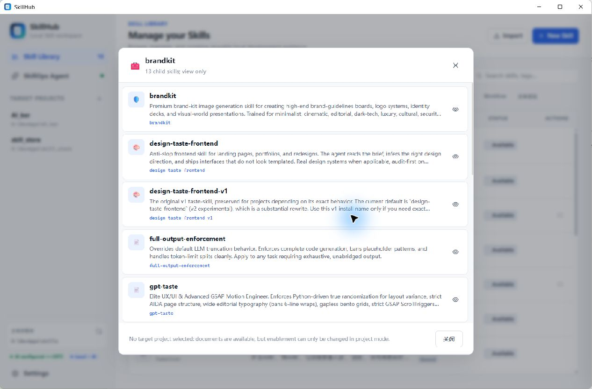
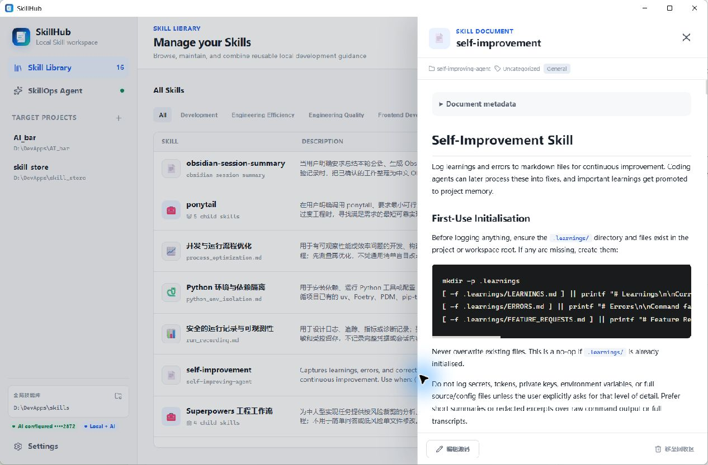
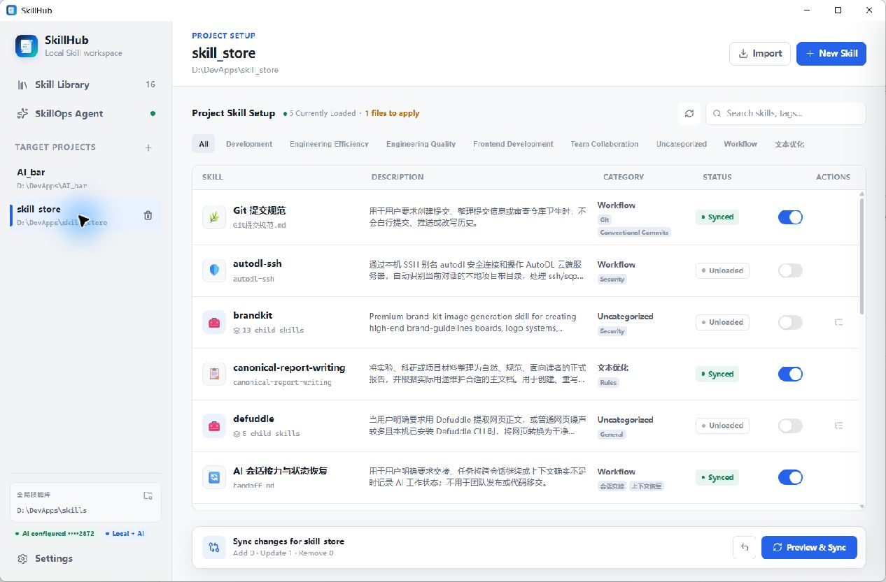
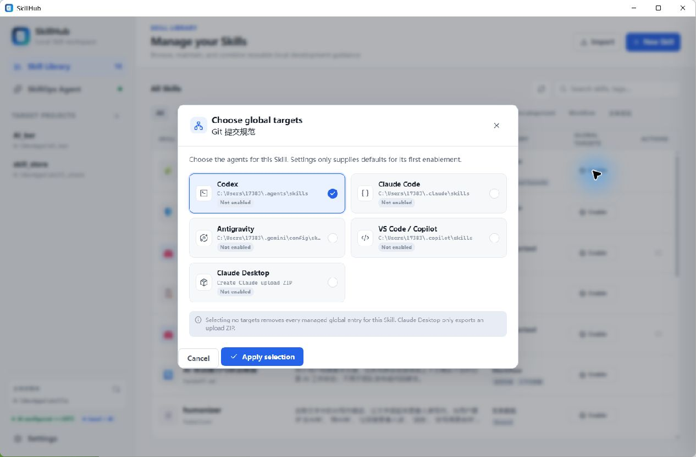
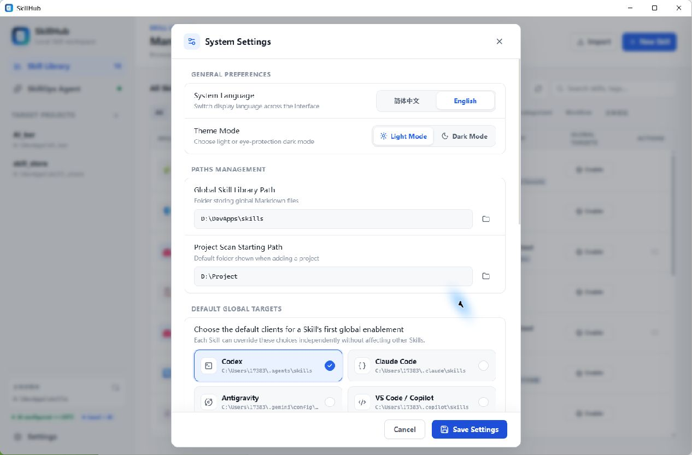
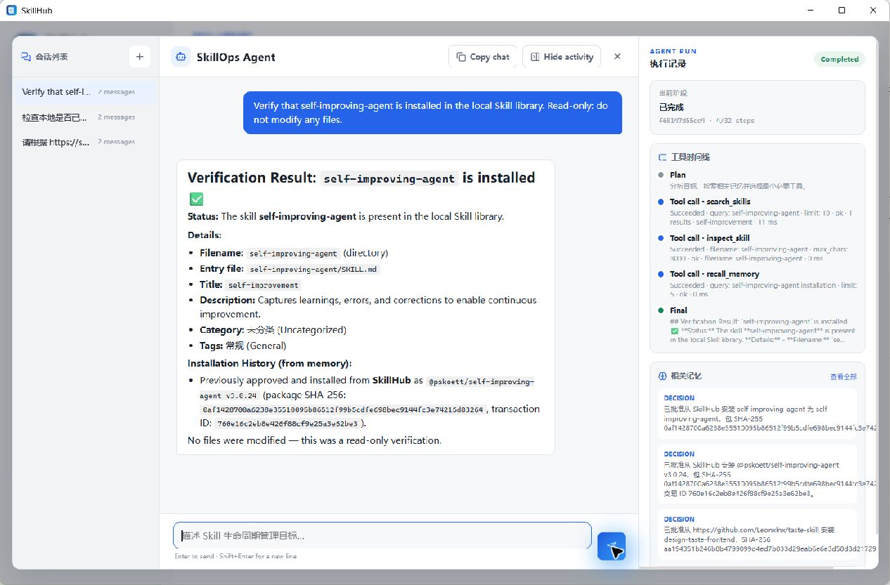

# SkillHub

[中文](README.md) · [User manual](docs/SkillHub使用说明书.md) · [Architecture & Technical Manual](docs/ARCHITECTURE.md) · [Download the latest release](https://github.com/w1ndmiIl/skill_store/releases/latest) · [MIT License](LICENSE)

SkillHub is a local AI Skill management and synchronization tool. It keeps reusable development rules, workflows, and specialist capabilities in one place, then applies them selectively to projects or clients such as Codex, Claude Code, Cursor, Cline, OpenCode, Windsurf, Gemini CLI, and VS Code/Copilot. Current version: **3.6.3**.

3.6.3 adds collection rule editing, continues inspection after its queue is closed, and improves category compatibility and asynchronous window state handling. See the [3.6.3 release notes](docs/releases/v3.6.3.md).

Every mutation follows a review-first workflow: imports receive local inspection, project synchronization shows file-level additions, updates, removals, and conflicts, and Agent writes are bound to one-time approvals and current hashes. Settings, sessions, memory, trash, and backups stay on the local machine.



*Screenshots use synthetic Skills, a demonstration project, and sanitized paths. They contain no real credentials, sessions, or project content.*

## Feature overview

| Capability | Current behavior |
| --- | --- |
| Skill asset management | Import Markdown, ZIP files, standard `SKILL.md` folders, and repository collections; search, categorize, sort, edit, inspect, and restore from trash |
| Skill collections | Preserve repository boundaries and manage collection category, controller, child availability, and global targets per member |
| Usage metadata | Edit both `SKILL.md` and optional `agents/openai.yaml` through an explained form or raw YAML |
| Multi-client distribution | Select Codex, Claude Code, Cursor, Cline, OpenCode, Windsurf, Antigravity, Gemini CLI, VS Code/Copilot, or Claude Desktop independently for each Skill |
| Project synchronization | Choose Skills per project; preview file changes, conflicts, and global/project scope overlap before writing; safely undo eligible changes |
| Fixed project rules | Pin the project's root `AGENTS.md` at the top of project view, with manual editing, preview, saving, and recoverable drafts |
| Controlled AI drafting | Automatic AI optimization and general Agent tools cannot modify `AGENTS.md`; AI returns a draft only after one explicit authorization, and the user must still save it |
| SkillOps Agent | Search, inspect, preview imports, and plan project synchronization through bounded tools; show steps, timing, memory, approvals, and stop controls |
| Reliable persistence | Use atomic writes, shared transaction locks, validated backups, and explicit recovery for sessions, settings, tasks, and memory |
| Local safety boundary | Treat external Skills, pages, repositories, tool results, and recalled memory as untrusted data; never execute imported scripts, hooks, or MCP services |

## Problems SkillHub solves

- Skills are scattered across directories, repositories, and clients.
- AI coding clients use different discovery paths, causing repeated configuration.
- Projects require different Skill sets, while direct copying creates conflicts and stale duplicates.
- Imports and synchronization need previews, ownership records, and rollback to avoid overwriting work.

SkillHub is intended for developers who use multiple AI coding clients, maintain multiple projects, or have accumulated reusable custom Skills.

## Core workflow

Import → local inspection → categorization or collection organization → project or global target selection → preview and conflict review → synchronization, global enablement, or rollback.

## Product capabilities

### 1. Skill asset management

SkillHub imports Markdown, ZIP files, standard `SKILL.md` folders, and repository collections. It provides one workspace for browsing, search, categories, editing, display localization, trash recovery, and deterministic inspection while keeping display metadata separate from source semantics.

New Skills should use `<name>/SKILL.md`. Legacy single-file Skills remain usable; import inspection and library audits flag their layout.

#### Multi-Skill collections



Repository imports are scanned for collection boundaries. A collection can be disabled as a unit while each child Skill remains reviewable and independently selectable.

#### Persistent trash


Deleted Skills move into persistent trash. They can be restored individually or in batches after an application restart, or permanently removed through an explicit confirmation. Existing same-name files are never overwritten.

#### Skill document details



The detail drawer presents source information, category, tags, Frontmatter, and rendered Markdown. Wide tables expand the reading surface and scroll inside the table on smaller windows instead of collapsing columns into one-word lines.

#### Skill usage configuration

Standard Skill folders expose both `SKILL.md` and `agents/openai.yaml`. The OpenAI metadata editor defaults to an explained form for display metadata, the recommended starter prompt, implicit invocation policy, and tool dependencies, while retaining raw YAML as an advanced mode. Global enablement controls availability for a target client; `allow_implicit_invocation` independently controls whether the model may select the Skill automatically.

### 2. Distribution and project sync

#### Per-project configuration



Each project selects its own Skills. The view combines source descriptions, categories, sync status, and enablement controls. A bottom action bar summarizes pending changes and opens a preview before writing. Every executable library Skill can independently target Codex, Claude Code, Cursor, Cline, OpenCode, Windsurf, Antigravity, Gemini CLI, VS Code, or Claude Desktop without binding it to a project.

The root `AGENTS.md` is pinned first and labeled as the project's fixed development rules. It never enters the global Skill library, collections, enablement state, or synchronization selection. If it is missing, viewing the placeholder does not create a file.


The project-rules editor supports manual editing, Markdown preview, `Ctrl+S`, draft recovery, and external-change detection. Automatic AI optimization, AI-generated Skill saving, and general SkillOps Agent write tools cannot modify `AGENTS.md`. “Authorize AI draft” grants one request bound to the current project and file version. AI never writes the file; the user must review the draft and click Save.




Settings only maintains first-enable defaults; each Skill can override them in the same target-selection dialog.



If the same Skill is already enabled in user scope and selected for the current project, SkillHub reports a scope overlap and requires explicit confirmation. It does not merge or automatically remove either entry, avoiding silent changes to the global environment used by other projects.

Generated project content lives at:

```text
<project>\.agent\skills\
<project>\AGENTS.md
```

## Main features

| Capability | Current behavior |
| --- | --- |
| Global Skill library | Manage Markdown guidance, standard `SKILL.md` folders, and Skill collections |
| Skill usage configuration | Visually edit `agents/openai.yaml` interface metadata, invocation policy, and tool dependencies with an advanced YAML mode |
| Multi-client global enablement | Choose Codex, Claude Code, Cursor, Cline, OpenCode, Windsurf, Antigravity, Gemini CLI, VS Code/Copilot, or Claude Desktop independently for each Skill; publishing creates a client-specific view without rewriting the source Skill |
| Claude Desktop export | Build a correctly structured upload ZIP; Claude Desktop still requires manual upload from `Customize > Skills` because it does not watch a local Skill directory |
| Import inspection | Locally detect duplicates, same-name conflicts, risky entries, path issues, and compatibility across ten clients; Claude tool pre-approval receives a separate warning |
| Bilingual descriptions | Use display-only localization without rewriting third-party `SKILL.md` |
| Project synchronization | Preview additions, updates, removals, file conflicts, and global/project scope overlaps before writing |
| Sync rollback | Undo the most recent sync when affected project files have not changed again |
| Fixed project rules | Pin project `AGENTS.md`; provide manual editing, preview, drafts, and conflict protection without adding it to the Skill library or sync selection |
| Project-rules AI draft | Disable automatic AI writes; one explicit authorization produces a reviewable draft that still requires manual Save |
| SkillOps Agent | Optional bounded module for finding, inspecting, previewing, and maintaining Skills with background progress, timing, memory, and approvals |
| Persistent trash | Restore deleted Skills across restarts, with batch recovery, conflict reporting, and explicit permanent deletion |
| Data recovery | Protect settings, sessions, tasks, and memory with atomic writes, validated backups, and explicit recovery |
| Single-instance startup | A second launch focuses the existing window instead of opening another |
| Local data model | Skills, settings, sessions, Agent memory, and backups stay on the machine |

### 3. Optional AI assistance

SkillOps Agent is an auxiliary module built on top of SkillHub's existing library and project synchronization workflows. It can help find, inspect, preview, install, and maintain Skills, but it does not replace manual imports, editing, categorization, or synchronization and does not expose an unrestricted shell.

The conversation list shows readable titles, overviews, timestamps, and run status, with search and rename controls. The default overview is derived locally; Generate AI summary sends the conversation context to the configured provider only when requested, while retaining message history. Category selection supports search and keyboard navigation. See the [3.6.2 release notes](docs/releases/v3.6.2.md).

Follow-up messages in the same chat restore a bounded and sanitized tail of that conversation so the Agent can resolve omissions and references. Structured long-term memory remains separate for project facts, preferences, and approved decisions. The current message takes precedence, and earlier assistant replies cannot authorize writes, network access, or approval-policy changes.



The model can only call predefined bounded tools. The runtime rejects clearly unrelated requests and checks the original goal, network intent, active project, write intent, and preview binding before every relevant tool call. Skill bodies, web pages, repository documentation, tool results, and recalled memories are marked as untrusted data and cannot change the role, permissions, or approval policy.

Installation, saving, and synchronization require a preview. Approval is bound to the exact tool, target arguments, content or tree hashes, and a one-time approval ID; a changed target invalidates the old approval. Long-term memory accepts only allowlisted fields and explicit memory intent, and rejects content that attempts to broaden permissions, skip approval, or rewrite security rules.

Tasks can continue in the background while the UI displays the current phase, tool timeline, and recalled memory. Stop is cooperative: no later operation starts, completed effects remain, and project synchronization should be reverted through its dedicated undo action.

## Quick start

1. Download `SkillHub.exe` from [GitHub Releases](https://github.com/w1ndmiIl/skill_store/releases/latest).
2. Launch the app and choose a global Skill library.
3. Import a `.md`, `.zip`, standard Skill folder, or Skill collection.
4. Optionally adjust target defaults in Settings, then choose clients separately from each Skill's global action.
5. For per-project configuration, add a target project and select the Skills it needs.
6. View or manually maintain the root `AGENTS.md` first, then review the sync preview and confirm the write.
7. Optional: open SkillOps Agent for assisted inspection, installation, or maintenance.

The application is portable and requires no installer. Its default writable data location is:

```text
%LOCALAPPDATA%\SkillHub
```

## Run from source

```powershell
git clone https://github.com/w1ndmiIl/skill_store.git
cd skill_store
python -m venv .venv
.\.venv\Scripts\Activate.ps1
python -m pip install -r requirements.txt
python main.py
```

Build the portable executable:

```powershell
.\.venv\Scripts\python.exe -B -X utf8 scripts/build.py
```

## Development checks

After installing the project dependencies, ensure Node.js 22+ and Git are on PATH, then run with the project environment:

```powershell
.\.venv\Scripts\python.exe -B -X utf8 scripts/check.py
```

This runs JavaScript syntax checks, Python regressions, frontend interaction tests, Agent security evaluations, and diff checks. It stops with a nonzero exit code on failure and uses a temporary application data directory instead of personal sessions or configuration. GitHub Actions runs the same entry point on Windows for pushes and pull requests.

Keep shared regression tests in the tracked `tests/` directory. Keep private data, experiments, and legacy tests in the ignored `.local/` directory. Packaging and a real application walkthrough are still required before release.

## Repository layout

Source is organized by layered responsibility:

```text
├── skillhub/                # Application, domain, infrastructure, and API implementation
├── agent_runtime.py         # Agent loop, tool protocol, approvals, memory, and run records
├── main.py                  # Backend, file operations, sync, and Agent tool adapters
├── static/                  # PyWebView frontend, interactions, and bundled resources
├── tests/                   # Shared regression tests
├── security_evals/          # Agent security evaluations
├── scripts/                 # Development check entry points
├── docs/
│   ├── SkillHub使用说明书.md
│   └── screenshots/
│       ├── zh/              # Chinese interface screenshots
│       └── en/              # English interface screenshots
├── SkillHub.spec            # PyInstaller build entry
└── requirements.txt
```

## Security and privacy

- API keys remain in local configuration and are shown only in masked form.
- Agent memory and run records exclude API keys, complete sensitive files, and hidden chain of thought.
- External Skills, pages, and tool results are untrusted data, not new operating instructions.
- The Agent is limited to Skill lifecycle work; unrelated, unauthorized network, cross-project, and read-only-to-write calls are blocked at runtime.
- Agent writes bind preview hashes, current target state, an argument digest, and a one-time approval ID, so stale approvals cannot be reused.
- Same-name, different-content targets require an explicit replace, keep-both, or cancel decision.
- Imports never execute repository hooks, MCP servers, installer scripts, or downloaded code.
- Unmanaged project files are not silently overwritten.
- Release builds exclude personal Skills, local configuration, tests, sessions, memory, and run logs.

The fixed regression suite in `security_evals/` covers prompt injection, Markdown/Base64 hidden instructions, secondary injection, domain escape, cross-project access, memory poisoning, stale approval, and secret leakage. Run it with:

```powershell
python -B security_evals\run_security_evals.py
```

The current 12 deterministic cases establish a baseline of 100% normal-task completion and out-of-scope refusal, with 0% attack success, dangerous tool execution, approval bypass, sensitive-information leakage, and false refusal. This suite checks deterministic runtime controls and does not replace continuing red-team evaluation against real models.

## Boundaries and next steps

- SkillOps Agent is not a general-purpose Agent and does not handle weather, finance, general programming, or private-file requests.
- Remote installation is limited to constrained public sources and isolated previews; downloaded scripts, hooks, and MCP services are never executed.
- Future work will expand real-model attacks, encoded and multilingual variants, and measurement of the security/usability balance.

## Tech stack

- Python + [pywebview](https://pywebview.flowrl.com/)
- System WebView2 runtime
- HTML, CSS, and JavaScript
- Optional OpenAI-compatible API and DuckDuckGo web search

## License

[MIT](LICENSE)

## Local reliability and workflow update

The current implementation includes background Agent progress and stop controls, persistent trash, recoverable drafts, external-change protection, manual project-rules editing with authorized AI drafts, sorting, and pagination. Sessions, settings, tasks, and memory use transactional writes and corruption protection. The build entry point generates the executable, checksum, and `BUILD_INFO.json` source fingerprint.
