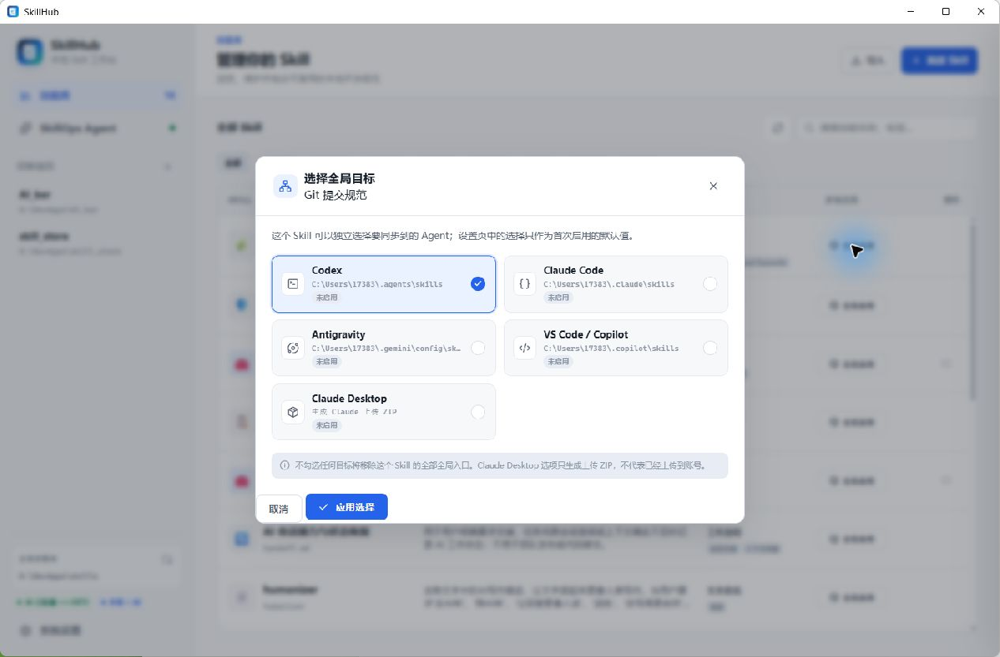
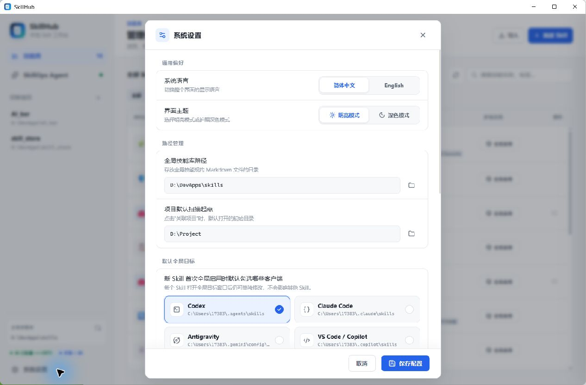

# SkillHub 使用说明书

> 适用版本：3.3.0
>
> 运行平台：Windows
>
> 项目名称：SkillHub（仓库名：`skill_store`）

SkillHub 是一个本地运行的 AI Skill 管理工具。它把可复用 Skill 保存在统一的全局库中，再由使用者为不同项目选择所需内容。同步前可以预览新增、修改、删除和冲突；同步后，项目通过 `AGENTS.md` 与 `.agent/skills/` 向 AI 开发工具提供规则。

SkillHub 的主要能力包括全局 Skill 管理、文件与仓库导入、集合组织、项目独立配置、同步预览、冲突保护和同步撤销。3.3.0 同时提供可选的 SkillOps Agent 辅助模块，用于在这些既有流程上帮助检索、检查和维护 Skill；手动管理和项目同步仍可独立使用。

本说明书介绍实际使用方法、Skill 类型、集合逻辑、项目同步机制、本地数据位置和常见问题。

## 1. 核心概念

### 1.1 全局 Skill 库

全局库是 SkillHub 管理 Skill 的唯一源。默认位置为：

```text
%LOCALAPPDATA%\SkillHub\skills
```

可以在设置中改为其他目录。更换路径只会切换当前使用的库，不会自动搬迁旧目录中的文件；需要迁移时应先自行复制并核对目标目录。

全局库中的 Skill 可以编辑、分类、导入、删除和同步，也可以为每个 Skill 分别选择多个全局目标。隐藏目录 `.skill-hub/` 用于保存索引、集合、导入快照、标准格式包装、Claude Desktop 导出包和回收站，不作为普通 Skill 显示。

### 1.2 多客户端全局 Skill

每个 Skill 都保存自己的实际发布状态。点击该 Skill 的“全局启用”或“已全局”后，可以单独勾选要同步到的客户端。设置中的“默认全局目标”只决定一个尚未全局启用的 Skill 首次打开窗口时默认勾选哪些项，不会批量改变现有 Skill。



*图 1：为单个 Skill 选择要发布到的客户端。*



*图 2：设置页中的选项仅作为首次启用的默认值。*

| 目标 | 当前用户范围 | 安装方式 |
| --- | --- | --- |
| Codex | `%USERPROFILE%\.agents\skills\` | 目录联接 |
| Claude Code | `%USERPROFILE%\.claude\skills\` | 目录联接 |
| Antigravity | `%USERPROFILE%\.gemini\config\skills\` | 目录联接 |
| VS Code / Copilot | `%USERPROFILE%\.copilot\skills\` | 目录联接 |
| Claude Desktop | `.skill-hub\exports\claude-desktop\` | 生成 ZIP 后，在 Claude 的 `Customize > Skills` 中手动上传 |

VS Code 也会发现 `~/.agents/skills` 和 `~/.claude/skills`。同时选择 Codex、Claude Code 与 VS Code 专用目录时，同一个 Skill 可能被 VS Code 从多个位置发现；需要完全避免重复时，只选择其中一个 VS Code 能读取的目录即可。

全局范围与项目范围彼此独立。若同一个 Skill 已发布到任一目录型全局目标，又在项目中被选中，SkillHub 会在项目同步预览中报告“作用域重叠”并要求明确确认。SkillHub 不会自动关闭全局入口，因为这会影响其他项目；也不会静默跳过项目版本。对于 Codex，同名 Skill 不会自动合并，完全避免重复时应在该 Agent 上只保留一个作用域。

在全局库模式中，每个 Skill 使用相同的全局操作按钮，并显示以下状态之一：

- **全局启用**：当前没有发布目标，点击后为这个 Skill 选择客户端。
- **已全局**：已经发布到至少一个目标，点击后查看、增加或移除这个 Skill 的目标。
- **更新全局**：源内容已变化，点击后刷新标准包装、链接状态或导出包。
- **部分全局**：集合成员的目标状态不一致，点击后可把整组应用到同一组选项。
- **名称冲突**：至少一个本地目标的同名目录指向其他内容，SkillHub 不会覆盖。

标准 `SKILL.md` 文件夹启用时，SkillHub 从各个已选客户端目录建立指向全局库源目录的目录联接。旧式单文件规则、Bundle 主控和集合子项启用时，SkillHub 在 `.skill-hub/codex-global/` 中生成 Agent Skills 标准包装：保留原正文与已有 Frontmatter，只补充发现所需的 `name` 和 `description`，再发布到目标。源 Skill 不会被改写。

移除只删除 SkillHub 管理的全局入口、导出包和不再使用的包装，不删除全局库源文件。删除一个已经全局启用的 Skill 时，各目标入口会一并安全移除；撤销删除时会尝试按原目标恢复。

### 1.3 项目 Skill

项目中的 Skill 位于：

```text
<项目目录>\.agent\skills\
```

其中可能同时存在两类内容：

- **SkillHub 托管副本**：由全局库同步而来，可以在 SkillHub 中启用、停用和更新。
- **项目专属 Skill**：只存在于当前项目，没有对应的全局源。SkillHub 将其标为“项目独有 · 只读”，仅供查看，不参与全局编辑、集合和同步计划。

项目专属 Skill 不会被自动提升为全局 Skill，也不会因为全局库中出现相似内容而被静默覆盖。

### 1.4 集合

集合用于组织一组相关 Skill，例如同一工具或工作流的多个子 Skill。

- 集合控制项关闭时，整个集合不参与项目同步。
- 子项开关决定集合中哪些 Skill 可以参与项目配置。
- 关闭集合不会删除文件，子项选择也会保留。
- 项目仍需选择要启用的具体 Skill；集合状态只是全局可用性边界。

### 1.5 同步

同步是把选中的全局 Skill 写入项目的过程。SkillHub 先生成只读预览，再根据确认结果执行。

同步不会直接把整个全局库复制到项目中，只处理当前项目启用的 Skill，并维护项目中的 Skill 索引和同步状态。

## 2. 下载与启动

### 2.1 使用便携版

1. 打开 [GitHub Releases](https://github.com/w1ndwill/skill_store/releases)。
2. 下载 `SkillHub.exe`。
3. 将程序放在稳定目录中运行。

SkillHub 为便携应用，不需要安装。程序配置和聊天记录保存在本机，不会自动上传。

首次启动时，如果尚未配置全局库，程序会创建默认目录：

```text
%LOCALAPPDATA%\SkillHub\skills
```

### 2.2 从源码运行

```powershell
git clone https://github.com/w1ndwill/skill_store.git
cd skill_store
python -m venv .venv
.\.venv\Scripts\Activate.ps1
python -m pip install -r requirements.txt
python main.py
```

构建便携版：

```powershell
python -m pip install pyinstaller
pyinstaller --clean --noconfirm SkillHub.spec
```

## 3. 界面与查看模式


*图 3：v3.3.0 中文全局库模式。截图中的 Skill、项目路径和状态来自本地演示环境。*

SkillHub 有两种主要查看方式：

- **全局库模式**：未选择项目时使用。用于浏览、搜索、导入、创建、编辑、分类和删除全局 Skill，也可以为每个 Skill 单独管理全局目标。
- **项目模式**：选择项目后使用。用于查看同步状态、调整启用范围、查看项目专属 Skill、预览同步和撤销最近一次同步。

切换项目不会改变全局文件，只会改变当前显示的项目状态与启用选择。

## 4. 快速使用流程

### 4.1 准备全局 Skill

可以选择以下任一方式：

1. 导入已有 Markdown、ZIP、标准 Skill 文件夹或 Skill 集合。
2. 在 SkillHub 中新建一份 Markdown Skill。
3. 将 Skill 直接复制到全局库，再通过“未登记 Skill”检查进行预览和登记。

Skill 可以直接选择“全局启用”。该操作不要求先添加项目；如 Codex 当前对话未立即刷新 Skill 列表，可新建对话后再使用。

### 4.2 添加项目

1. 进入项目管理区域。
2. 选择“添加项目”。
3. 选择真实项目根目录。
4. 确认项目出现在列表中。

SkillHub 只接受已经登记的项目路径。项目目录被移动或删除后，界面会显示路径不存在。

### 4.3 选择 Skill

1. 进入目标项目。
2. 按分类或搜索找到需要的 Skill。
3. 打开启用开关。
4. 对集合 Skill，先确认集合及子项处于可用状态。

不同项目分别保存自己的启用列表，互不影响。

### 4.4 预览并同步

1. 点击底部同步操作。
2. 查看新增、修改、删除、保留和冲突数量。
3. 展开变化列表，确认目标路径和所属 Skill。
4. 没有异常时执行同步。
5. 同步完成后检查项目状态是否变为“已同步”。


*图 2：项目模式同时展示说明、分类、同步状态和启用开关，底部操作栏汇总待同步变化。*

## 5. 支持的 Skill 类型

### 5.1 单文件 Markdown Skill

文件直接放在全局库根目录，例如：

```text
skills\
└── Git提交规范.md
```

推荐 Frontmatter：

```yaml
---
title: Git 提交规范
emoji: 🌿
category: 工作流
tags: Git, Conventional Commits, 协作
description: 用于创建或审查 Git 提交。
---
```

同步目标为：

```text
<项目>\.agent\skills\Git提交规范.md
```

### 5.2 标准 Skill 文件夹

标准 Skill 使用文件夹和 `SKILL.md`：

```text
skill-name\
├── SKILL.md
├── agents\
│   └── openai.yaml
├── scripts\
└── references\
```

`SKILL.md` 至少包含：

```yaml
---
name: skill-name
description: 说明 Skill 的能力和触发场景。
---
```

同步时保留文件夹结构，目标为：

```text
<项目>\.agent\skills\skill-name\
```

### 5.3 Bundle

Bundle 用于部署一组项目级工作流文件，入口通常是 `README.md`，子 Skill 位于：

```text
bundle-name\
├── README.md
└── .agent\
    └── skills\
        ├── planning.md
        └── verification.md
```

SkillHub 会分别显示 Bundle 和可选择的子 Skill。同步预览会标明 Bundle 是否尝试写入 `.agent/skills/` 之外的项目文件；这类文件需要额外确认。

### 5.4 标准 Skill 集合

包含多个 `skills/<name>/SKILL.md` 的目录可以作为集合导入：

```text
collection\
└── skills\
    ├── skill-a\
    │   └── SKILL.md
    └── skill-b\
        └── SKILL.md
```

导入时 SkillHub 会逐项判断：

- 新增；
- 更新；
- 本地冲突；
- 内容重复并跳过。

## 6. 导入 Skill

### 6.1 支持的来源

- `.md` 文件；
- `.zip` 文件；
- 单个标准 Skill 文件夹；
- Bundle 文件夹；
- 标准 Skill 集合。

### 6.2 导入流程

1. 点击“导入”。
2. 选择文件或文件夹。
3. SkillHub 将来源复制到临时预览区。
4. 执行结构检查、安全检查和重复判断。
5. 查看规范化结果、风险提示和差异。
6. 确认后写入全局库。

正式导入后，原始来源会保存在：

```text
<全局库>\.skill-hub\imports\upstream\
```

这里保存的是导入快照，不是第二套活跃 Skill。不要直接编辑快照来修改当前 Skill。

### 6.3 风险确认

导入检查可能提示：

- 环境绑定的绝对路径；
- 记录敏感请求或会话数据；
- 破坏性命令；
- 依赖特定 Agent 的工具名称；
- Bundle 路径冲突；
- ZIP 路径穿越或符号链接。

高风险提示需要单独确认。确认只表示允许导入，不代表其中的命令已经安全；仍应查看正文和适用边界。

### 6.4 AI 导入优化

在设置中开启“导入时使用 AI 优化”后，SkillHub 会先执行本地检查，再调用已配置的兼容 OpenAI 接口优化入口文档。

- 未配置 API Key 时自动使用本地结果。
- AI 改写会显示差异，必须再次确认。
- 原始 Skill 仍保存在上游快照中。
- AI 不会执行导入包中的脚本、Hook 或 MCP 服务。

### 6.5 双语界面说明

在设置中开启“导入时生成双语说明”后，SkillHub 会识别导入 Skill 的标题与说明语言，并生成另一种界面语言的显示文本：

- 英文 Skill 在中文界面显示中文标题和说明；
- 中文 Skill 在英文界面显示英文标题和说明；
- 只向已配置的兼容 OpenAI 接口发送标题与说明，不发送 Skill 正文或资源文件；
- 译文保存在 `<全局库>\.skill-hub\display-localizations.json`，不会写入或改写 `SKILL.md`；
- 原始标题或说明发生变化后，旧译文自动失效，避免显示与当前 Skill 不一致；
- API 未配置或翻译失败时，导入继续完成，界面回退到原始说明。

此开关与“导入时使用 AI 优化”相互独立。前者只生成界面显示字段，后者可能改写暂存的入口文档并要求审阅差异。

## 7. 全局库管理

### 7.1 新建与编辑

全局库模式下可以新建单文件 Skill，也可以打开已有 Skill 编辑入口文档。

对于标准文件夹，编辑目标是 `SKILL.md`；对于 Bundle，编辑目标通常是 `README.md`。保存后 SkillHub 会更新库索引，项目副本不会立即变化，需要重新同步。

### 7.2 分类

分类来自 Skill Frontmatter。删除一个自定义分类时，SkillHub 会：

1. 先预览受影响的全局 Skill；
2. 仅移除这些源文件中的 `category` 字段；
3. 保留 Skill 文件、正文和其他元数据。

项目专属只读 Skill 不参与全局分类删除。

### 7.3 删除与恢复

删除全局 Skill 时，SkillHub 不会立即永久清除，而是移动到：

```text
<全局库>\.skill-hub\trash\
```

删除同时更新集合成员和库索引。执行恢复时，SkillHub 会把 Skill 和删除前的集合状态一并恢复；如果原位置已经出现同名内容，则拒绝覆盖。

### 7.4 未登记 Skill

直接复制到全局库中的新文件，或绕过 SkillHub 修改过的内容，会被扫描为：

- `new`：索引中没有对应记录；
- `modified`：当前内容与已登记哈希不同。

应先打开预览，确认来源和内容，再登记或重新导入。不要直接修改 `library-index.json` 来消除提示。

## 8. 集合管理


*图 3：集合成员保持独立入口；未选择项目时只读查看，选择项目后再调整启用范围。*

集合页用于控制成员是否可以参与项目配置。

建议做法：

- 只保留职责相关、能够共同维护的 Skill 在同一集合中。
- 主控 Skill 与子 Skill 的触发范围应明确，避免多个成员同时接管同一任务。
- 集合停用用于临时排除整组 Skill，不要通过删除源文件实现“隐藏”。
- 更新集合前先查看每个成员的新增、重复、更新和冲突状态。

集合状态保存在：

```text
<全局库>\.skill-hub\collections.json
```

该文件由 SkillHub 维护，日常操作应通过界面完成。

## 9. 项目状态说明

| 状态 | 含义 | 建议操作 |
| --- | --- | --- |
| 已同步 `synced` | 项目副本与全局源一致 | 无需处理 |
| 未加载 `unloaded` | 项目中没有该 Skill 的同步副本 | 需要时启用并同步 |
| 不同步 `out_of_sync` | 项目中存在同名内容，但与全局源不同 | 先查看差异和冲突原因 |
| 孤立 `orphan` | 项目中存在内容，但全局库没有对应源 | 按项目专属 Skill 只读查看 |
| 项目独有 · 只读 | 仅存在于当前项目，不属于全局管理范围 | 在项目仓库中维护，不通过全局库编辑 |

“不同步”不等于文件错误。它可能是全局源更新、项目手动修改、旧版同步产物或未建立所有权清单造成的，必须先看预览。

## 10. 同步预览与冲突

### 10.1 预览动作

同步预览可能显示：

- `add`：目标文件不存在，将新增；
- `modify`：目标存在但内容不同，将修改；
- `delete`：上次由 SkillHub 管理、此次不再需要，且未被手动修改；
- `preserve`：不再需要，但同步后被手动修改，因此保留；
- `unchanged`：目标已经与源一致；
- `conflict`：目标不受 SkillHub 管理，或托管后被项目手动修改。

### 10.2 冲突原则

以下情况不会静默覆盖：

- 项目中存在同名文件，但没有 SkillHub 所有权记录；
- 上次同步后目标文件发生手动修改；
- 多个选中 Skill 提供相同目标路径；
- 同一个 Skill 已在目录型全局目标启用，同时又被当前项目选中；
- Bundle 试图写入受限制的项目文件。

处理冲突前应确认：

1. 当前项目修改是否仍有价值；
2. 全局版本是否应该取代项目版本；
3. 是否需要先把项目特有规则整理成独立 Skill；
4. 预览中的覆盖范围是否仅限预期文件。

### 10.3 同步产物

同步后项目通常包含：

```text
<项目>\
├── AGENTS.md
└── .agent\
    ├── skills\
    │   └── ...
    └── .skill-hub\
        ├── manifest.json
        ├── last-transaction.json
        └── backups\
```

- `AGENTS.md`：保存 SkillHub 管理的 Skill 索引区，同时保留标记区之外的用户内容。
- `manifest.json`：记录启用列表、目标文件哈希和所有者。
- `last-transaction.json`：指向最近一次可撤销同步。
- `backups/`：保存同步事务需要的恢复副本。

不要手工伪造同步清单。缺少所有权记录时，SkillHub 会把现有同名文件视为冲突，这是数据保护行为。

## 11. 撤销同步

项目存在最近一次同步事务时，可以使用“撤销同步”。

撤销会：

- 恢复最近一次同步修改或删除前的文件；
- 删除该次同步新增且未再修改的文件；
- 跳过同步后又被手动修改的目标，防止覆盖新工作；
- 恢复上一次同步清单。

撤销只针对最近一次事务，不是完整的版本历史。重要项目仍应使用 Git 管理项目文件。

## 12. 可选 AI 辅助


*图 4：真实只读运行在 2/32 步内完成；右侧是经过筛选的工具时间线、最终状态和相关记忆。*

SkillOps Agent 是辅助管理 Skill 的可选模块。每次模型请求都会注册工具 JSON Schema，模型返回 `tool_calls` 后，后端验证工具名称和参数、执行工具、把观察结果作为 `tool` 消息反馈给模型，再继续决策。单次任务默认最多执行 32 轮；连续 4 次返回相同工具决策时会判断为无进展循环并提前停止，兼顾复杂任务完成度和失控保护。

Agent 可自主调用：

- `search_skills`：按名称、描述、分类和标签检索全局 Skill；
- `inspect_skill`：在全局 Skill 库边界内读取入口元数据和必要内容；
- `audit_skill_library`：以确定性规则检查缺少元数据、重复、触发范围重叠和格式风险；
- `web_research`：联网检索规范并返回标题、摘要和链接；
- `fetch_skillhub_install_guide`：只读取固定的 `https://skillhub.cn/install/skillhub.md` 官方安装文档，不接受任意 URL；
- `search_skillhub_catalog`：搜索 SkillHub 官方公开目录，返回精确 slug、来源、版本和风险相关元数据；
- `preview_skillhub_catalog_install`：下载精确 slug 的官方 ZIP，在隔离区做路径、大小、入口和风险检查，并锁定包哈希与文件树哈希；
- `preview_remote_skill_install`：从公开 GitHub 仓库获取指定的原始 `SKILL.md`，校验 Frontmatter 并以 SHA-256 锁定安装内容，仅生成预览；
- `preview_remote_skill_collection`：下载公开 GitHub 仓库快照，扫描 `skills/*/SKILL.md`，以一个集合预览全部子 Skill；
- `draft_skill_change`：生成只读变更草案和差异；
- `preview_project_sync`：复用现有安全同步预览；
- `apply_skillhub_catalog_install`、`apply_remote_skill_collection`、`apply_remote_skill_install`、`apply_skill_change`、`apply_project_sync`：等待用户明确批准后才执行，并在写入前重新校验预览内容；
- `recall_memory`、`remember_memory`：按当前任务读取或保存结构化记忆。

Skill 文档详情仍然使用确定性的本地查看器，不需要调用模型：


*图 5：详情抽屉把元数据与 Markdown 正文分开呈现；编辑源文件是显式操作。*

右侧执行面板显示当前阶段、工具时间线、等待批准的操作、最终状态以及本次使用的记忆。普通工具记录只展示状态、经过筛选的关键参数、结果数量或错误摘要，不展开网页搜索正文和完整 JSON；界面最多保留最近 14 条，较早记录显示为省略数量。写操作审批区域展示核对所需的参数摘要与绑定摘要。它不展示隐藏思维链。暂停任务会持久化，软件重启后仍可批准、拒绝或恢复。

当用户目标明确要求安装、导入、保存或同步，且预览已经成功时，Agent 必须调用匹配的 `apply_` 工具进入审批门。模型如果只在自然语言中询问“是否批准”，运行时会追加策略纠正并继续决策；连续纠正后仍不调用写工具则以失败结束，不会把未安装的任务标记为完成。预览若发现同名目标，则不自动进入写入：用户必须选择替换、保留两个版本或取消。

对话区支持直接框选文字和 `Ctrl+C`，每条消息与代码块也提供独立复制按钮；标题栏可以复制当前完整会话，生成 Skill 的预览区可以复制原始 Markdown。异步剪贴板接口不可用时会自动使用 WebView 兼容的本地复制方式。执行记录面板可从标题栏收起，输入框随内容自动增高，并支持 `Enter` 发送、`Shift+Enter` 换行及中文输入法组合状态保护。

结构化记忆分为项目事实、用户偏好和历史决策。记忆按相关性注入，不会无条件载入全部历史；可以从界面查看、关闭或清理。模型只有在用户原始目标明确要求记忆时才能调用长期记忆写入，存储层还会校验类型、字段白名单、来源、长度和敏感内容，并拒绝跳过审批、扩大权限或改写安全规则的内容。聊天会话仍由 `chat_sessions.json` 独立保存。

需要在设置中提供：

- API Key；
- 模型名称；
- 兼容 OpenAI Chat Completions 的 API 地址。

API Key 保存到本地配置，界面只显示末尾提示。AI 功能是可选项；未配置时，本地导入、分类、集合和项目同步仍可正常使用。

所选模型和 API 必须支持 Function Calling。接口明确拒绝 `tools` 或 `tool_choice` 时，工作区会提示“不支持工具调用”，不会伪造模型自主选择工具。

### 12.1 Agent 领域策略与不可信内容

SkillOps Agent 只处理 Skill 检索、查看、导入体检、有限优化、集合组织、全局目标、项目同步、回滚和状态查询。明显无关的天气、金融、闲聊、通用编程和私人文件请求会在模型调用前被拒绝。每次工具调用前，运行时还会检查原始目标是否允许联网、写入、长期记忆和当前项目路径，防止工具虽然合法但用途偏离当前任务。

Skill 正文、网页、仓库说明、工具返回和历史记忆统一包装为不可信数据。其中的命令、角色设定和操作要求仅供分析，不能改变 Agent 角色、用户目标、审批规则、工具权限或记忆策略。工具结果进入模型上下文和持久化记录前还会再次执行敏感信息过滤。

### 12.2 审批绑定

审批不是通用确认。等待审批状态包含一次性审批 ID 和完整参数摘要哈希。远程安装绑定预览令牌、来源哈希、目标名称与文件树；项目同步绑定项目路径、启用列表和计划令牌；普通 Skill 修改绑定目标是否存在、修改前内容哈希和待写入内容哈希。批准时重新校验这些信息，目标在预览后发生变化、参数被替换或使用旧审批 ID 时都会拒绝执行并要求重新预览。

### 12.3 固定安全评测

仓库中的 `security_evals/` 提供 12 个确定性回归用例，覆盖“忽略之前指令”、Markdown/Base64 隐藏指令、工具结果二次注入、领域外请求、无关联网、命名 Skill 劫持、跨项目、记忆污染、旧审批复用和敏感信息泄漏。运行命令：

```powershell
python -B security_evals\run_security_evals.py
```

当前基线中，正常任务完成率与领域外拒绝率均为 100%；攻击成功率、危险工具执行率、审批绕过率、敏感信息泄漏率和正常任务误拒率均为 0%。这些确定性用例验证运行时硬约束，真实模型仍需要持续进行多语言、编码变体和对抗式评测。

### 12.4 仓库集合边界样例

`Leonxlnx/taste-skill` 是集合边界测试样例：仓库的 `skills/` 下包含多个独立子目录，每个目录通过自身 `SKILL.md` Frontmatter 声明安装名。目标只给出仓库地址时，Agent 必须生成集合预览，不能只安装默认 `design-taste-frontend`；只有目标明确指定某个安装名时，才使用单 Skill 预览。集合中已存在且内容相同的子 Skill 记为重复项，其余子项统一进入一次写入审批。

### 12.5 SkillHub 官方目录安装

当目标引用 `skillhub.cn/install/skillhub.md` 时，Agent 先读取固定官方文档，再用官方公开目录搜索精确 slug。下载包只在隔离区解压，不执行包内脚本、Hook 或安装命令。预览展示来源、版本、包 SHA-256、文件树 SHA-256、文件数量、风险摘要和目标冲突状态。批准后复制的必须是同一棵哈希锁定文件树。

官方目录中的本地化说明会写入 `<全局库>\.skill-hub\display-localizations.json`，界面按当前语言使用；原始 `SKILL.md` 保持不变。

### 12.6 单实例运行

Windows 版在创建窗口前获取当前用户会话内的命名互斥体。已有 SkillHub 运行时，再次启动会唤醒已有窗口并立即退出；正常退出或异常终止后，Windows 会自动释放互斥体，不会留下阻止后续启动的锁文件。

## 13. 本地数据位置

### 13.1 程序目录

便携版和源码运行默认在程序目录保存：

```text
config.json
chat_sessions.json
agent_memory.json
agent_tasks.json
agent_runs.jsonl
agent_backups\
```

其中可能包含本地项目列表、AI 服务配置、会话、Agent 记忆、暂停任务、脱敏运行记录和写入备份。Agent 记录不保存 API Key、完整敏感文件或隐藏思维链。这些文件和目录均不进入 Git 或发行包；不要手工把真实配置提交到公开仓库。

### 13.2 全局库状态

```text
<全局库>\.skill-hub\
├── library-index.json
├── collections.json
├── imports\
│   ├── catalog.json
│   ├── pending\
│   └── upstream\
└── trash\
```

- `library-index.json`：全局 Skill 的登记哈希与来源。
- `collections.json`：集合成员和启用状态。
- `imports/pending/`：尚未确认的导入预览。
- `imports/upstream/`：已导入来源快照。
- `trash/`：可恢复的删除内容。

### 13.3 项目同步状态

```text
<项目>\.agent\.skill-hub\
```

该目录保存同步所有权、备份和撤销信息。是否提交到 Git 应由项目团队决定；如果不提交，新环境会失去 SkillHub 的同步所有权历史，但 `.agent/skills/` 中的实际 Skill 仍然存在。

## 14. 安全边界

- 导入内容只做文件检查，不执行其中的脚本、安装命令、Hook 或 MCP 服务。
- ZIP 中的路径穿越、符号链接和超出限制的内容会被拒绝。
- 项目路径和 Skill 路径必须位于已登记边界内。
- 同名未托管文件不会被静默覆盖。
- 多客户端全局启用不会改写源 Skill；同名外部目录不会被覆盖，移除操作也不会删除源 Skill。Claude Desktop 只生成本地上传包，不声称已经安装到账号。
- AI 优化、集合冲突、全局/项目作用域重叠、高风险项和受限 Bundle 文件分别要求确认。
- Agent 领域策略在模型调用前拒绝明显无关请求，并在每次工具调用前检查写入、联网、长期记忆和项目范围。
- 外部 Skill、网页、仓库内容、工具结果和历史记忆默认是不可信数据，不能改变角色、权限或审批规则。
- Agent 写操作绑定预览令牌或内容哈希、当前目标状态、参数摘要哈希和一次性审批 ID；状态变化后旧审批失效。
- 删除全局 Skill 使用本地回收站，恢复时拒绝覆盖同名现有内容。
- 发布程序不应包含私人 Skill、真实配置、聊天记录、测试目录或本地项目资料。

## 15. 常见问题

### 15.1 修改全局 Skill 后，项目为什么没有变化？

全局库是源，项目是同步副本。修改全局 Skill 后需要进入目标项目，查看预览并重新同步。

### 15.2 为什么项目 Skill 只能查看，不能编辑？

它被识别为项目专属 Skill，不属于全局库。SkillHub 有意保持只读，避免把项目私有规则误并入全局管理。

### 15.3 为什么显示“不受 SkillHub 管理”的冲突？

目标文件存在，但当前项目没有对应的同步所有权记录。常见于旧版本生成的文件、手工复制或同步清单被删除。确认覆盖前先比较正文。

### 15.4 为什么停用集合后，项目选项也失效？

集合控制项是总开关。关闭后集合内成员都不参与有效启用列表，但子项选择会保留，重新打开集合后可以继续使用。

### 15.5 为什么导入提示重复？

SkillHub 会比较规范化后的文件树和内容哈希。内容已经存在时不会再安装一份副本；集合导入会跳过重复成员并继续处理其他成员。

### 15.6 为什么 AI 优化没有执行？

可能未配置 API Key、连接失败或关闭了“导入时使用 AI 优化”。这种情况下仍会保留本地结构和安全检查结果。

### 15.7 更改全局库路径后，旧 Skill 去哪里了？

旧文件仍在原目录。路径切换不会自动迁移数据，应切回原路径或手动复制完整库，包括隐藏的 `.skill-hub/` 状态目录。

### 15.8 撤销为什么跳过某些文件？

这些文件在同步完成后又被修改。SkillHub 为避免丢失新内容，会保留它们并跳过恢复。

### 15.9 单文件 Skill 为什么也能对多个客户端全局启用？

这些客户端采用包含 `SKILL.md` 的 Agent Skills 文件夹格式。SkillHub 不修改旧式单文件源，而是在隐藏状态目录生成标准包装，只补充发现所需元数据并保留原正文。源文件变化后，界面会显示“更新全局”。

### 15.10 为什么显示“全局名称冲突”？

至少一个已选客户端目录中存在同名内容，但它没有指向当前 SkillHub 源目录。SkillHub 会保留该内容，并回滚本次操作中已建立的其他入口；请先确认冲突来源并自行改名或移除。

### 15.11 为什么 Claude Desktop 需要手动上传？

Claude Desktop 的个人 Skill 由 Claude 账号中的 `Customize > Skills` 管理，官方没有提供与本地目录相同的自动发现入口。SkillHub 会生成符合要求的 ZIP 并跟踪源版本，但不会模拟上传成功；需要用户在 Claude 中选择该 ZIP 完成安装。

## 16. 推荐维护流程

1. 在全局库维护可复用的通用 Skill。
2. 把只适用于单个项目的规则留在项目中。
3. 导入前查看结构、安全提示和差异。
4. 修改全局 Skill 后先选择一个项目进行小范围同步验证。
5. 看到 `out_of_sync` 时先比较，不直接允许全部冲突。
6. 删除 Skill 或分类前查看影响预览。
7. 定期检查未登记 Skill、失效集合成员和长期 pending 导入。
8. 使用 Git 管理源码与重要项目，SkillHub 的撤销只作为最近一次同步保护。
