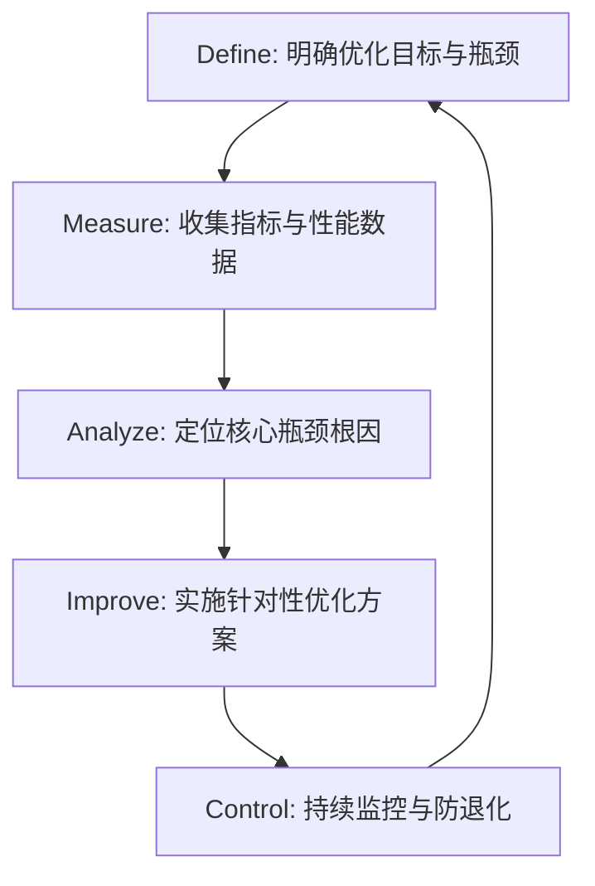

# 流程优化技能指南 (Process Optimization Skill Guide)

系统化软件开发与系统运行流程优化指南，覆盖本地开发、构建部署及运行时执行效率。

---

## 1. 核心流程优化方法论

进行任何流程优化时，应严格遵循 **DMAIC** 闭环法则：



### 优化基本原则
1. **数据驱动**：无测量，不优化。必须有基准测试（Benchmark）或量化指标（Metrics）支撑。
2. **抓主要矛盾**：优先解决耗时最长、频次最高、阻塞感最强的环节（遵循阿姆达尔定律 Amdahl's Law）。
3. **二八法则**：20% 的流程节点往往消耗了 80% 的时间/资源。
4. **渐进式改进**：小步快跑，单次只改动一个变量，每次改动后必须执行验证。

---

## 2. 优化场景与落地指南

### 场景 A：本地开发与构建优化 (Local Dev & Build Optimization)

#### 1. 诊断与测量
- **Web 项目**：使用 `vite-plugin-visualizer` 或 `webpack-bundle-analyzer` 分析包体积与依赖关系。
- **构建计时**：在构建命令中加入计时（例如 PowerShell 的 `Measure-Command { npm run build }` 或 Linux 的 `time npm run build`）。
- **热更新延迟**：检查是否存在大文件未被 `.gitignore` 或工具的忽略列表包含，导致文件监听器（Watcher）超负荷。

#### 2. 核心优化策略
*   **缓存机制**：
    *   启用编译器/打包工具缓存（如 Webpack 5 持久化缓存、Turborepo / Nx 任务缓存）。
    *   在 package.json 中配置合理的缓存策略。
*   **并行与多进程**：
    *   使用 `thread-loader` 或多线程编译器（如 `esbuild`, `swc`）替代传统的单线程 Babel 转译。
*   **依赖按需引入**：
    *   杜绝全量导入大型库（如 `lodash` -> `lodash-es`，`antd` 开启 Babel 自动按需引入）。
    *   使用更轻量的替代品（如 `dayjs` 替代 `moment`）。

---

### 场景 B：持续集成与部署优化 (CI/CD Pipeline Optimization)

#### 1. 诊断与测量
- 分析 GitHub Actions、GitLab CI 等工具 of Run Time 瀑布图。
- 找出最耗时的步骤（通常是 `npm install`、`Docker build` 或全局测试）。

#### 2. 核心优化策略
*   **依赖缓存（Dependency Caching）**：
    *   在 CI 配置文件中明确缓存 `~/.npm`、`node_modules` 或 `.yarn/cache`。
    *   示例 (GitHub Actions):
        ```yaml
        - name: Cache Node Modules
          uses: actions/cache@v3
          with:
            path: ~/.npm
            key: ${{ runner.os }}-node-${{ hashFiles('**/package-lock.json') }}
            restore-keys: |
              ${{ runner.os }}-node-
        ```
*   **多阶段构建（Multi-stage Docker Builds）**：
    *   利用 Docker 缓存层。将 `package.json` 的复制和 `npm install` 放在代码复制代码之前。
*   **并行与矩阵执行**：
    *   将单元测试、集成测试、代码检查（Lint）和格式化（Format）拆分为可并行运行的独立 Job。
    *   使用 Matrix 矩阵并发测试不同环境。

---

### 场景 C：运行时执行与算法优化 (Runtime Execution Optimization)

#### 1. 诊断与测量
- **CPU 性能瓶颈**：使用 Chrome DevTools Profile, Node.js `--inspect` 或 Python `cProfile` 进行火焰图分析。
- **I/O 与数据库瓶颈**：慢查询日志（Slow Query Log）、Redis 监控（`MONITOR` 命令）。

#### 2. 核心优化策略
*   **空间换时间**：使用 Map/Set 替代双重循环的 Array 查找，将复杂度从 $O(N^2)$ 降低到 $O(N)$。
*   **计算缓存**：针对高频次、高耗时的纯函数使用记忆化缓存（Memoization / LRU Cache）。
*   **异步非阻塞**：
    *   避免串行等待无依赖的异步任务，利用 `Promise.all` 并发执行。
    *   对于重计算任务，采用 Web Workers 或后台多进程处理。
*   **数据库查询优化**：
    *   合理建立索引，避免全表扫描。
    *   避免 N+1 查询问题，使用 `JOIN` 或预加载（Eager Loading）。
    *   只查询需要的列，避免使用 `SELECT *`。

---

## 3. 验证与控制检查单（Verification Checklist）

优化完成后，必须进行全方位的验证，确保“既快又准”：

| 验证项 | 验证手段 / 命令 | 预期结果 |
| :--- | :--- | :--- |
| **功能等价性** | 执行自动化单元测试 (`npm run test` / `pytest`) | 100% 通过，无回归 Bug |
| **性能基准对比**| 重复测量并对比耗时数据 | 相比优化前有明显可度量的提升（例如耗时降低 >30%） |
| **资源开销** | 观察 CPU、内存、网络 I/O 占用情况 | 内存无泄漏，CPU 峰值平稳 |
| **系统稳定性** | 压力测试或并发模拟测试 | 高负载下系统不崩溃，错误率 < 0.1% |
