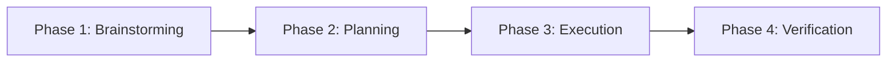

# AGENTS.md - Project Superpowers Master Rules

This file defines the **Superpowers Structured Engineering Workflow** that any AI coding agent (like Antigravity or Claude Code) must strictly follow when working in this repository.

> [!IMPORTANT]
> **DO NOT write any code, modify any files, or execute any commands before initiating the Superpowers workflow.** 
> You must follow the structured phases sequentially for every task.

---

## 🚀 The Superpowers Workflow Phases

Every task must progress through these four distinct phases. Do not skip phases or jump ahead.

### 1. 🧠 Phase 1: Brainstorming (探索与头脑风暴)
*   **Goal**: Fully understand the requirement, explore the technical constraints, and uncover any hidden risks.
*   **Instructions**:
    1.  Read the user request thoroughly.
    2.  Use search and reading tools to research the existing codebase, dependencies, and architecture.
    3.  Ask clarifying questions or present 2-3 potential architectural designs to the user.
    4.  **Reference Skill**: [brainstorm.md](file:///.agent/skills/brainstorm.md)

### 2. 📝 Phase 2: Planning (详细技术规划)
*   **Goal**: Create a highly granular, test-driven, and step-by-step roadmap before any changes are made.
*   **Instructions**:
    1.  Create `docs/plans/implementation_plan.md` to outline the design decisions, modified files, and verification criteria.
    2.  Create `docs/plans/task.md` as an interactive TODO list using the standard checkmark format (`- [ ]`).
    3.  Break tasks down into small, isolated chunks that take no more than 2-5 minutes to implement.
    4.  **Reference Skill**: [planning.md](file:///.agent/skills/planning.md)

### 3. 🛠️ Phase 3: Execution (测试驱动执行)
*   **Goal**: Implement the changes sequentially in highly focus steps, verifying each piece as you go.
*   **Instructions**:
    1.  Mark the current sub-task as `[/]` (in progress) in `docs/plans/task.md`.
    2.  Write unit tests *before* or *concurrently* with the implementation (TDD).
    3.  Implement the narrowest scope of changes necessary to pass the test.
    4.  Once verified, mark the task as `[x]` (completed) and proceed to the next step.
    5.  **Reference Skill**: [tdd_execution.md](file:///.agent/skills/tdd_execution.md)

### 4. 🔍 Phase 4: Verification & Walkthrough (全面测试与交付)
*   **Goal**: Perform final checks and provide a detailed walkthrough of the changes.
*   **Instructions**:
    1.  Run the entire automated test suite to ensure zero regression.
    2.  Perform a systematic code review of all modified files.
    3.  Create or update `docs/plans/walkthrough.md` to summarize the accomplishments and show test results.
    4.  **Reference Skill**: [verification.md](file:///.agent/skills/verification.md)

---

## 🛠️ Composed Skills Directory

To trigger a specific phase or access specialized procedures, you can read the corresponding skill files located under:
*   🧠 **Brainstorming**: [brainstorm.md](file:///.agent/skills/brainstorm.md)
*   📝 **Planning**: [planning.md](file:///.agent/skills/planning.md)
*   🛠️ **TDD Execution**: [tdd_execution.md](file:///.agent/skills/tdd_execution.md)
*   🔍 **Verification & Code Review**: [verification.md](file:///.agent/skills/verification.md)
*   🔄 **流程接力与工作交接 (Handoff & Context Resume)**: [handoff.md](file:///.agent/skills/handoff.md)
